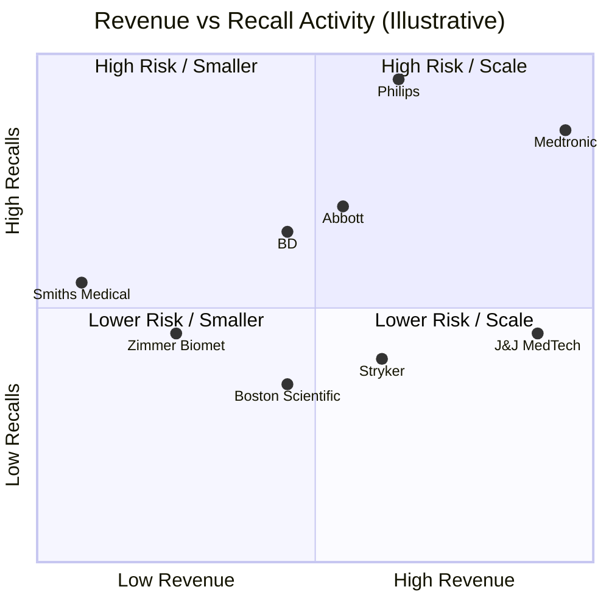

# Medical Device Industry Analysis

## Purpose

This folder contains market intelligence on medical device manufacturers, focusing on:
1. Company size and revenue rankings
2. FDA recall activity and patterns
3. Cross-reference analysis for RecallWire market targeting

## Documents

| Document | Description |
|----------|-------------|
| [01-top-companies-by-revenue.md](./01-top-companies-by-revenue.md) | Top 100+ medical device companies ranked by annual revenue |
| [02-vendors-by-recall-count.md](./02-vendors-by-recall-count.md) | Vendors ranked by FDA recall events (2020-2024) |
| [03-hospital-buyer-landscape.md](./03-hospital-buyer-landscape.md) | GPOs, IDNs, health systems, and key decision makers |

## Key Insights

### Market Size vs. Recall Correlation

The largest medical device companies by revenue are often also the largest by recall count - but this is largely a function of portfolio size:

### Top 10 Companies Appearing on Both Lists

| Company | Revenue Rank | Recall Rank | Notes |
|---------|--------------|-------------|-------|
| Medtronic | #1 | #2 | Largest company, high HVAD recall activity |
| Philips | #6 | #1 | Respironics mega-recall dominates |
| Abbott | #8 | #3 | Cardiac device focus |
| BD | #12 | #4 | Infusion pump issues |
| Baxter | #10 | #5 | IV/infusion products |
| GE HealthCare | #7 | #6 | Imaging, monitoring |
| J&J MedTech | #2 | #12 | Lower relative recall rate |
| Stryker | #5 | #9 | Surgical, ortho |
| Zimmer Biomet | #18 | #10 | Ortho implants |
| Boston Scientific | #11 | #11 | Cardiac, interventional |

### RecallWire Target Market Implications

**Tier 1 Targets (Highest recall volume, largest budgets)**:
- Philips, Medtronic, Abbott, BD, Baxter

**Tier 2 Targets (Significant recall activity)**:
- GE HealthCare, Smiths Medical, Fresenius, Stryker, Zimmer Biomet

**Tier 3 Targets (Moderate but consistent recall activity)**:
- Boston Scientific, J&J MedTech, Cardinal Health, Teleflex, Edwards

### Recall Trends to Watch

1. **Software-related recalls increasing** - 35% of all recalls, up from 25% five years ago
2. **Class I recalls at 15-year high** - More serious defects being identified
3. **Respiratory device focus** - Post-Philips scrutiny of CPAP/ventilator industry
4. **Infusion pump spotlight** - BD Alaris issues driving regulatory attention
5. **Cybersecurity recalls emerging** - New category of recalls for connected devices

## Data Sources

- FDA CDRH Recall Database
- Medical Design & Outsourcing Medtech Big 100
- Sedgwick Recall Index Reports
- SEC filings and company annual reports
- Industry publications (MedTech Dive, MassDevice, 24x7)

## Last Updated

December 2024
