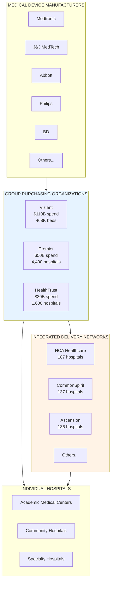
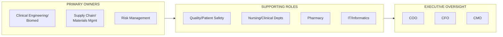

# Hospital Buyer Landscape

## Overview

This document maps the hospital and health system landscape for RecallWire's go-to-market strategy. Understanding who purchases medical devices and who manages recalls within healthcare organizations is critical for targeting and positioning.

## Market Structure

## Group Purchasing Organizations (GPOs)

GPOs aggregate purchasing power for hospitals, negotiating contracts with manufacturers. **96% of U.S. acute care hospitals use a GPO**, saving an estimated 10-18% on procurement costs.

### Top GPOs by Market Share

| Rank | GPO | Annual Spend | Staffed Beds | Hospitals | Market Share |
|------|-----|--------------|--------------|-----------|--------------|
| 1 | **Vizient** | $110B | 468,000 | 5,000+ | ~29% of beds |
| 2 | **Premier** | $50B | 333,000 | 4,400 | ~21% of beds |
| 3 | **HealthTrust** | $30B | 250,000+ | 1,600 | ~16% of beds |
| 4 | **Intalere** | $20B | 100,000+ | 1,100 | ~6% of beds |
| 5 | **GNYHA** | $8B | 60,000+ | 250 | ~4% of beds |

**Top 3 GPOs control ~80% of the market**

### GPO Profiles

#### Vizient (Irving, TX)
- **Members**: 5,000+ health systems, 1,360 acute care hospitals
- **Coverage**: 97% of U.S. Academic Medical Centers, 50%+ of acute care
- **Services**: Supply chain, analytics, consulting, pharmacy solutions
- **Key Members**: Mayo Clinic, Cleveland Clinic, Kaiser Permanente, Baylor Scott & White
- **Website**: vizientinc.com

#### Premier (Charlotte, NC)
- **Members**: 4,400 hospitals, 250,000+ other providers
- **Coverage**: 76% of U.S. community hospitals
- **Services**: Supply chain, quality improvement, population health
- **Key Members**: Geisinger, Ochsner, AdventHealth
- **Website**: premierinc.com

#### HealthTrust (Nashville, TN)
- **Members**: 1,600 hospitals, 26,000+ non-acute sites
- **Coverage**: Strong in South/Southeast regions
- **Services**: Supply chain, clinical integration, advisory
- **Key Members**: HCA Healthcare (parent company relationship)
- **Website**: healthtrustpg.com

### GPO Value Proposition for RecallWire

| GPO Role | RecallWire Opportunity |
|----------|----------------------|
| Centralized contracting | Single point to reach thousands of hospitals |
| Member communications | Channel for recall alerts to members |
| Data aggregation | Device tracking across member systems |
| Quality programs | Recall compliance as a quality metric |

## Integrated Delivery Networks (IDNs)

IDNs are health systems that own/operate multiple hospitals and care sites. There are approximately **576 IDNs** in the United States.

### Top 25 IDNs by Revenue (2024)

| Rank | Health System | HQ | Revenue | Hospitals | Beds | GPO |
|------|--------------|-------|---------|-----------|------|-----|
| 1 | **Kaiser Permanente** | Oakland, CA | $115.8B | 39 | 11,000+ | Vizient |
| 2 | **HCA Healthcare** | Nashville, TN | $70.6B | 187 | 41,000+ | HealthTrust |
| 3 | **CommonSpirit Health** | Chicago, IL | $37.0B | 137 | 25,000+ | Premier |
| 4 | **Advocate Health** | Charlotte, NC | $31.7B | 69 | 14,000+ | Premier |
| 5 | **Providence** | Renton, WA | $30.7B | 51 | 10,000+ | Vizient |
| 6 | **UPMC** | Pittsburgh, PA | $29.9B | 40 | 8,500+ | Vizient |
| 7 | **Ascension** | St. Louis, MO | $28.6B | 136 | 19,000+ | Vizient |
| 8 | **Trinity Health** | Livonia, MI | $23.9B | 93 | 15,000+ | Premier |
| 9 | **Tenet Healthcare** | Dallas, TX | $20.7B | 52 | 12,000+ | HealthTrust |
| 10 | **Mass General Brigham** | Somerville, MA | $20.6B | 16 | 4,000+ | Vizient |
| 11 | **Mayo Clinic** | Rochester, MN | $19.8B | 35 | 4,500+ | Vizient |
| 12 | **Intermountain** | Salt Lake City, UT | $17.1B | 33 | 5,000+ | Vizient |
| 13 | **Northwell Health** | New Hyde Park, NY | $16.9B | 21 | 4,500+ | Premier |
| 14 | **Cleveland Clinic** | Cleveland, OH | $16.2B | 22 | 6,700+ | Vizient |
| 15 | **Baylor Scott & White** | Dallas, TX | $15.8B | 52 | 8,000+ | Vizient |
| 16 | **NYU Langone** | New York, NY | $14.5B | 6 | 2,500+ | Vizient |
| 17 | **AdventHealth** | Altamonte Springs, FL | $14.2B | 51 | 9,000+ | Premier |
| 18 | **Bon Secours Mercy** | Cincinnati, OH | $13.8B | 49 | 8,000+ | Vizient |
| 19 | **Christus Health** | Irving, TX | $12.5B | 61 | 9,500+ | Premier |
| 20 | **Sanford Health** | Sioux Falls, SD | $12.0B | 48 | 4,000+ | Vizient |
| 21 | **Atrium Health Wake Forest** | Winston-Salem, NC | $11.8B | 40 | 6,000+ | Premier |
| 22 | **OhioHealth** | Columbus, OH | $11.5B | 15 | 3,500+ | Premier |
| 23 | **Sentara Healthcare** | Norfolk, VA | $11.2B | 12 | 2,800+ | Vizient |
| 24 | **Henry Ford Health** | Detroit, MI | $10.9B | 6 | 2,200+ | Premier |
| 25 | **Mercy** | St. Louis, MO | $10.5B | 49 | 7,000+ | Premier |

### IDN Characteristics

| Type | Description | # of Systems | Example |
|------|-------------|--------------|---------|
| **For-Profit** | Investor-owned chains | ~50 | HCA, Tenet, UHS |
| **Catholic** | Religious-affiliated nonprofit | ~60 | CommonSpirit, Ascension, Trinity |
| **Academic** | University-affiliated | ~100 | Mayo, Cleveland Clinic, UPMC |
| **Regional Nonprofit** | Community-based nonprofit | ~350 | Northwell, Intermountain |
| **Government** | VA, county, public | ~20 | VA, NYC Health + Hospitals |

## Key Decision Makers for Recall Management

### Who Owns Recall Management?

Recall management typically involves multiple departments. The primary owner varies by organization:

### Title Directory: Key Contacts for RecallWire

#### C-Suite / Executive
| Title | Responsibility | Recall Role |
|-------|---------------|-------------|
| Chief Operating Officer (COO) | Operations oversight | Budget approval, strategic decisions |
| Chief Financial Officer (CFO) | Financial management | Cost of recalls, liability |
| Chief Medical Officer (CMO) | Clinical quality | Patient safety decisions |
| Chief Nursing Officer (CNO) | Nursing operations | Clinical staff communication |
| Chief Supply Chain Officer | Supply chain strategy | GPO relationships, vendor mgmt |

#### Director / VP Level
| Title | Responsibility | Recall Role |
|-------|---------------|-------------|
| VP of Supply Chain | End-to-end supply chain | Overall recall coordination |
| VP of Quality & Patient Safety | Quality programs | Recall tracking, outcomes |
| Director of Clinical Engineering | Medical equipment | Device recalls, remediation |
| Director of Materials Management | Procurement, inventory | Inventory quarantine, returns |
| Director of Risk Management | Liability, compliance | Patient notification, legal |
| Director of Pharmacy | Medication management | Drug-device combination recalls |

#### Manager / Coordinator Level
| Title | Responsibility | Recall Role |
|-------|---------------|-------------|
| **Recall Coordinator** | Dedicated recall management | Primary point of contact |
| Clinical Engineering Manager | Equipment maintenance | Device identification, repair |
| Materials Manager | Inventory control | Product quarantine, tracking |
| Quality Manager | Quality systems | Documentation, reporting |
| Biomedical Engineering Manager | Device lifecycle | Technical assessment |
| OR Materials Coordinator | Surgical supplies | Instrument/implant recalls |

### Department Responsibilities by Recall Type

| Recall Type | Primary Owner | Supporting Departments |
|-------------|---------------|----------------------|
| **Capital Equipment** (imaging, monitors) | Clinical Engineering | IT, Radiology, Supply Chain |
| **Implantable Devices** (ortho, cardiac) | Risk Management + Surgery | Clinical Engineering, Medical Records |
| **Consumables** (syringes, tubing) | Materials Management | Nursing, Pharmacy |
| **Software/SaMD** | IT/Informatics | Clinical Engineering, Vendors |
| **Surgical Instruments** | Sterile Processing | OR, Clinical Engineering |

## Hospital Market Segmentation

### By Size

| Segment | Bed Count | # in U.S. | Characteristics |
|---------|-----------|-----------|-----------------|
| **Large** | 500+ beds | ~300 | Dedicated recall staff, sophisticated systems |
| **Medium** | 200-499 beds | ~900 | Part-time recall coordination, mixed systems |
| **Small** | 100-199 beds | ~1,200 | Shared responsibilities, manual processes |
| **Critical Access** | <100 beds | ~1,300 | Limited resources, high reliance on GPOs |

### By Type

| Type | # in U.S. | Device Intensity | Recall Complexity |
|------|-----------|------------------|-------------------|
| **Academic Medical Centers** | ~400 | Very High | High - research devices, clinical trials |
| **Community Hospitals** | ~3,000 | Medium-High | Medium - standard equipment |
| **Specialty Hospitals** | ~500 | Variable | High - concentrated device types |
| **Surgery Centers (ASCs)** | ~6,000 | Medium | Medium - surgical focus |
| **Long-Term Care** | ~15,000 | Low | Low - limited device use |

## Recall Management Pain Points by Stakeholder

### Clinical Engineering / Biomed
- Manual tracking across multiple systems
- Difficulty matching serial numbers to inventory
- Manufacturer communication delays
- Coordinating service visits for corrections

### Supply Chain / Materials
- Fragmented recall notifications (mail, email, fax)
- Inventory quarantine and tracking
- Return logistics and credits
- GPO contract coordination

### Risk Management
- Patient identification for implants
- Surgeon and patient notification
- Documentation for liability protection
- Regulatory compliance tracking

### Quality / Patient Safety
- Outcome tracking for affected patients
- Root cause analysis
- Joint Commission compliance
- Reporting metrics

## Regional Considerations

### Top States by Hospital Beds

| Rank | State | Staffed Beds | Major Systems |
|------|-------|--------------|---------------|
| 1 | California | 78,000+ | Kaiser, Sutter, Providence |
| 2 | Texas | 65,000+ | HCA, Baylor Scott & White, Tenet |
| 3 | Florida | 55,000+ | HCA, AdventHealth, Baptist |
| 4 | New York | 50,000+ | Northwell, NYU, Mount Sinai |
| 5 | Pennsylvania | 38,000+ | UPMC, Penn Medicine, Geisinger |
| 6 | Ohio | 35,000+ | Cleveland Clinic, OhioHealth |
| 7 | Illinois | 32,000+ | CommonSpirit, Advocate |
| 8 | Michigan | 28,000+ | Trinity, Henry Ford, Beaumont |
| 9 | Georgia | 25,000+ | Emory, Piedmont, HCA |
| 10 | North Carolina | 24,000+ | Atrium, Duke, Novant |

## RecallWire Target Account Strategy

### Tier 1: Enterprise IDNs (Top 25 by revenue)
- **Value Prop**: Enterprise-wide recall management, centralized dashboard
- **Decision Maker**: VP Supply Chain, Chief Quality Officer
- **Entry Point**: Pilot at 1-2 hospitals, expand system-wide
- **Contract Value**: $500K - $2M+ annually

### Tier 2: Regional IDNs (26-100 by revenue)
- **Value Prop**: Multi-facility coordination, GPO integration
- **Decision Maker**: Director of Materials Management, Quality Director
- **Entry Point**: System-level implementation
- **Contract Value**: $100K - $500K annually

### Tier 3: Large Standalone Hospitals
- **Value Prop**: Streamlined recall workflow, compliance reporting
- **Decision Maker**: Clinical Engineering Director, Materials Manager
- **Entry Point**: Single-site implementation
- **Contract Value**: $25K - $100K annually

### GPO Partnership Opportunity
- **Value Prop**: Member benefit, quality program enhancement
- **Decision Maker**: VP of Member Services, Quality Programs Director
- **Entry Point**: Co-marketing, member pricing programs
- **Revenue Model**: Per-member fees, data sharing agreements

## Sources

- [Definitive Healthcare: Top 10 GPOs by Staffed Beds](https://www.definitivehc.com/blog/top-10-gpos-by-staffed-beds)
- [Definitive Healthcare: Top IDNs by Revenue](https://www.definitivehc.com/resources/healthcare-insights/top-idns-by-net-patient-revenue)
- [Becker's Hospital Review: 65 Health Systems by Revenue](https://www.beckershospitalreview.com/finance/38-health-systems-ranked-by-annual-revenue/)
- [Becker's Hospital Review: 40 Largest Health Systems 2024](https://www.beckershospitalreview.com/rankings-and-ratings/40-largest-health-systems-in-the-us-2024/)
- [24x7 Magazine: Effectively Managing Recalls](https://24x7mag.com/standards/regulations/effectively-managing-recalls/)
- [MedTech Intelligence: How Providers Handle Device Recalls](https://medtechintelligence.com/news_article/providers-handle-device-recalls/)
- [Vizient Inc.](https://www.vizientinc.com)
- [Premier Inc.](https://www.premierinc.com)
- [HealthTrust Purchasing Group](https://www.healthtrustpg.com)
