# Device Categories & Recall Patterns

## Overview

This document provides a deep-dive analysis of medical device recalls by product category, including patterns, root causes, and category-specific considerations. Understanding these patterns helps RecallWire prioritize features and target messaging.

## FDA Medical Specialty Panels

The FDA organizes medical devices into 19 medical specialty panels. Each device is assigned a three-letter product code that maps to a specialty.

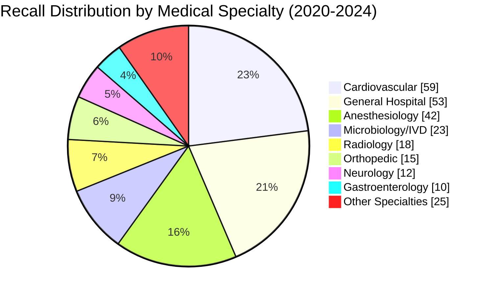

### Medical Specialty Panels

| Panel Code | Specialty | Common Devices | Recall Frequency |
|------------|-----------|----------------|------------------|
| CV | Cardiovascular | Pacemakers, stents, catheters, AEDs | Very High |
| HO | General Hospital | Infusion pumps, monitors, beds | Very High |
| AN | Anesthesiology | Ventilators, anesthesia machines | High |
| MI | Microbiology | IVD tests, diagnostic reagents | High |
| RA | Radiology | CT, MRI, X-ray systems | Medium |
| OR | Orthopedic | Joint implants, bone screws | Medium |
| NE | Neurology | DBS systems, monitoring | Medium |
| GU | Gastroenterology | Endoscopes, feeding tubes | Medium |
| SU | General Surgery | Surgical instruments, staplers | Medium |
| OB | Obstetrics/Gynecology | Fetal monitors, IUDs | Low |
| OP | Ophthalmic | IOLs, diagnostic equipment | Low |
| DE | Dental | Implants, imaging | Low |
| EN | Ear, Nose, Throat | Hearing aids, cochlear implants | Low |
| PM | Physical Medicine | Wheelchairs, prosthetics | Low |
| PA | Pathology | Tissue processors, slides | Low |
| TX | Toxicology | Drug testing devices | Low |
| IM | Immunology | Allergy tests, blood typing | Low |
| CH | Clinical Chemistry | Blood analyzers, glucose meters | Medium |
| HE | Hematology | Blood cell counters, coagulation | Low |

## Device Category Deep Dives

### 1. Cardiovascular Devices

**Recall Statistics**: 33% of all Class I recalls (highest of any category)

```mermaid
flowchart TD
    subgraph CardioDevices["CARDIOVASCULAR DEVICE TYPES"]
        A[Implantable<br/>Cardiac Devices]
        B[Interventional<br/>Devices]
        C[Monitoring<br/>Devices]
        D[External<br/>Therapy]
    end

    subgraph Implantable["IMPLANTABLE"]
        A --> A1[Pacemakers]
        A --> A2[ICDs/CRT-Ds]
        A --> A3[Heart Valves]
        A --> A4[VADs/LVAD]
        A --> A5[Leads]
    end

    subgraph Interventional["INTERVENTIONAL"]
        B --> B1[Coronary Stents]
        B --> B2[Catheters]
        B --> B3[Guidewires]
        B --> B4[Balloons]
        B --> B5[Closure Devices]
    end

    subgraph Monitoring["MONITORING"]
        C --> C1[ECG/Holter]
        C --> C2[Hemodynamic]
        C --> C3[Implantable Loop Recorders]
    end

    subgraph External["EXTERNAL THERAPY"]
        D --> D1[AEDs]
        D --> D2[External Defibrillators]
        D --> D3[Pacing Systems]
    end

    style A fill:#ff6b6b,color:#fff
    style D1 fill:#ff6b6b,color:#fff
```

#### Recall Breakdown by Device Type

| Device Type | % of CV Recalls | Common Issues |
|-------------|-----------------|---------------|
| ICDs/CRT-Ds | 40.8% | Battery depletion, shock delivery failure |
| Pacemakers | 14.5% | Battery issues, lead problems |
| Stents | 14.5% | Fracture, deployment failure |
| CRTs | 12.7% | Software bugs, sensing issues |
| Leads | 9.7% | Fracture, insulation breach |
| VADs/Artificial Hearts | 7.8% | Pump failure, thrombosis |

#### Top Root Causes (Cardiovascular)

| Cause | % of Recalls | Examples |
|-------|--------------|----------|
| Battery problems | 33.0% | Premature depletion, swelling |
| Therapy delivery failure | 31.1% | No shock, reduced energy |
| Software defects | 15.2% | Algorithm errors, display bugs |
| Component failure | 12.4% | Capacitor, circuitry issues |
| Manufacturing defects | 8.3% | Assembly errors, contamination |

#### Notable Cardiovascular Recalls (2020-2024)

| Year | Company | Device | Units | Issue |
|------|---------|--------|-------|-------|
| 2021 | Abbott | St. Jude Pacemakers | 100K+ | Battery depletion |
| 2021 | Boston Scientific | Pacemakers | 50K+ | Battery depletion |
| 2021 | Medtronic | ICDs | 350K+ | Reduced shock energy |
| 2022 | Abbott | HeartMate 3 | 2,200 | Outflow graft issue |
| 2023 | Medtronic | HVAD | All | Market withdrawal |

#### Key Manufacturers (Cardiovascular)

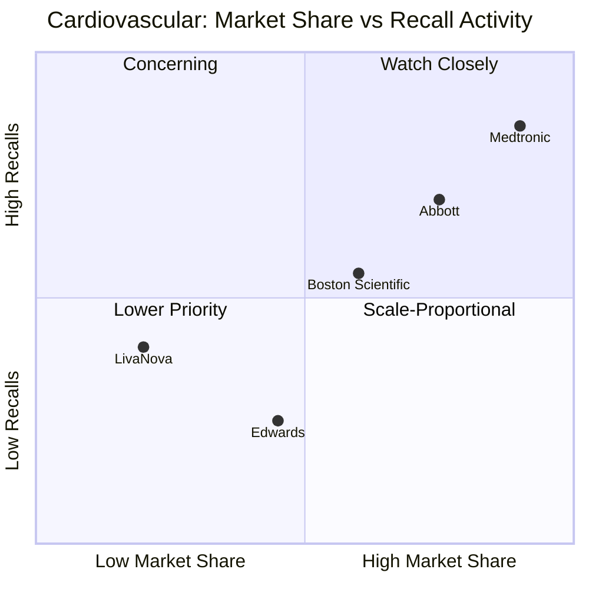

---

### 2. Respiratory Devices

**Recall Statistics**: 18% of Class I recalls

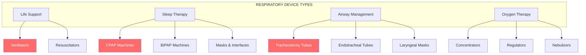

#### The Philips Respironics Mega-Recall

The largest medical device recall in history:

| Metric | Value |
|--------|-------|
| Units Affected | 15-18 million globally |
| Recall Date | June 2021 |
| Class | I (most serious) |
| Root Cause | PE-PUR foam degradation |
| Devices | CPAP, BiPAP, ventilators |
| Status | Ongoing remediation |

**Impact on Industry**:
- GAO investigation of FDA recall processes
- Increased scrutiny of all respiratory devices
- Competitor recalls (ResMed magnetic masks)
- Regulatory focus on material safety

#### Respiratory Recall Patterns

| Device Type | Recall Volume | Common Issues |
|-------------|---------------|---------------|
| Ventilators | Very High | Software, motor failure, alarms |
| CPAP/BiPAP | Very High | Foam degradation, motor issues |
| Tracheostomy | High | Cuff issues, connector failures |
| Masks/Interfaces | Medium | Magnetic hazards, seal issues |
| Nebulizers | Low | Contamination, output issues |

#### Key Manufacturers (Respiratory)

| Company | Market Position | Notable Recalls |
|---------|-----------------|-----------------|
| Philips | #1 (Sleep) | Respironics (15M+ units) |
| ResMed | #2 (Sleep) | Magnetic masks (2022) |
| Smiths Medical | Major | Tracheostomy tubes (19.7M units) |
| Medtronic | Major | Ventilators (Puritan Bennett) |
| Dräger | Major | Anesthesia, ventilators |
| Fisher & Paykel | Growing | Humidifiers, interfaces |

---

### 3. Infusion & IV Therapy Devices

**Recall Statistics**: 15% of Class I recalls

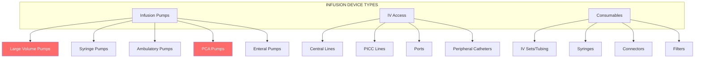

#### The BD Alaris Recall Saga

One of the most significant infusion pump recalls:

| Metric | Value |
|--------|-------|
| Units Affected | 4.8+ million |
| Recall Period | 2020-2023 (multiple) |
| Class | I |
| Root Cause | Software defects, hardware issues |
| FDA Action | Warning letter, import restrictions |

#### Infusion Device Recall Causes

| Cause | % of Recalls | Impact |
|-------|--------------|--------|
| Software errors | 42% | Dose calculation, display errors |
| Occlusion detection | 18% | Delayed alarm, over-infusion |
| Free-flow prevention | 15% | Uncontrolled drug delivery |
| Battery issues | 12% | Power failure during therapy |
| Air-in-line detection | 8% | Air embolism risk |
| Mechanical failure | 5% | Pump mechanism, motor |

#### Key Manufacturers (Infusion)

| Company | Products | Recall Activity |
|---------|----------|-----------------|
| BD | Alaris System | Very High |
| Baxter | Sigma Spectrum, Colleague | High |
| ICU Medical | Plum 360, LifeCare | Medium |
| Fresenius Kabi | Agilia, Volumat | Medium |
| B. Braun | Infusomat, Perfusor | Medium |
| Smiths Medical | CADD, Medfusion | Medium |

---

### 4. Orthopedic Devices

**Recall Statistics**: 12% of Class I recalls

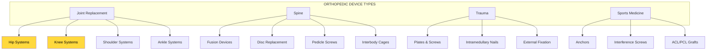

#### Major Orthopedic Recall: Exactech

| Metric | Value |
|--------|-------|
| Units Affected | 657,391+ |
| Initial Recall | February 2022 |
| Expansions | July 2022, March 2024, April 2024, December 2024 |
| Class | II |
| Root Cause | Defective vacuum packaging (missing oxygen barrier) |
| Devices | Knee, hip, ankle, shoulder implants |

**Impact**: Polyethylene oxidation causing accelerated wear, bone loss, and revision surgery needed in 2-3 years instead of 20-40 years.

#### Orthopedic Recall Patterns

| Device Type | Common Issues | Detection Timeframe |
|-------------|---------------|---------------------|
| Hip Implants | Metal-on-metal debris, loosening | 2-10 years post-implant |
| Knee Systems | Polyethylene wear, instability | 3-15 years post-implant |
| Spine Hardware | Fracture, migration, loosening | 1-5 years |
| Trauma Devices | Breakage, corrosion | 6 months - 2 years |
| Bone Cement | Mixing issues, sterility | Immediate |

#### Historical Major Orthopedic Recalls

| Year | Company | Device | Issue |
|------|---------|--------|-------|
| 2010 | DePuy (J&J) | ASR Hip | Metal debris, revision |
| 2016 | Zimmer Biomet | CPT Hip | Fracture risk |
| 2022 | Exactech | Multiple joints | Packaging/oxidation |
| 2023 | Zimmer Biomet | ROSA Robot | Software issues |

#### Key Manufacturers (Orthopedic)

| Company | Market Position | Focus Areas |
|---------|-----------------|-------------|
| Zimmer Biomet | #1 (Joints) | Hip, knee, spine |
| Stryker | #2 | Trauma, joints, robotics |
| J&J DePuy Synthes | #3 | Spine, trauma, joints |
| Smith+Nephew | Major | Joints, sports medicine |
| Medtronic | Major (Spine) | Spine, biologics |
| Globus Medical | Growing | Spine, robotics |

---

### 5. Diagnostic Imaging Equipment

**Recall Statistics**: Lower recall volume but high operational impact

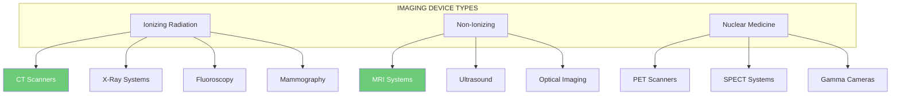

#### Imaging Recall Characteristics

| Characteristic | Pattern |
|----------------|---------|
| Volume | Lower (typically <5% of recalls) |
| Units per recall | Low (often single-digit) |
| Impact | High (capital equipment, workflow disruption) |
| Resolution time | Long (weeks to months) |
| Corrective action | Often software updates, field modifications |

#### Common Imaging Recall Issues

| Issue Type | Examples | Modalities |
|------------|----------|------------|
| Software errors | Dose calculation, image artifacts | CT, X-ray |
| Hardware failure | Gantry, table, tube issues | CT, MRI, X-ray |
| Radiation safety | Over-exposure, shielding | CT, Fluoro |
| Image quality | Artifacts, reconstruction errors | All |
| Patient safety | Table failure, RF burns | MRI |
| Cybersecurity | Network vulnerabilities | All connected |

#### Key Manufacturers (Imaging)

| Company | Market Position | Primary Modalities |
|---------|-----------------|-------------------|
| GE HealthCare | #1 (US) | CT, MRI, X-ray, Ultrasound |
| Siemens Healthineers | #1 (Global) | All modalities |
| Philips | #3 | CT, MRI, Ultrasound |
| Canon Medical | #4 | CT, MRI, X-ray |
| Fujifilm | Growing | X-ray, Ultrasound, Endoscopy |

---

### 6. In Vitro Diagnostics (IVD)

**Recall Statistics**: 23 recalls in microbiology/IVD (2020-2023 study period)

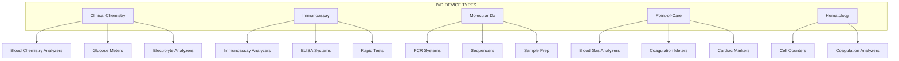

#### IVD Recall Patterns

| Issue Type | % of Recalls | Patient Impact |
|------------|--------------|----------------|
| False results | 35% | Misdiagnosis, delayed treatment |
| Reagent issues | 25% | Inaccurate values |
| Software bugs | 20% | Calculation errors |
| Calibration | 12% | Systematic bias |
| Contamination | 8% | Invalid results |

#### COVID-19 Impact on IVD Recalls

The pandemic significantly affected IVD recall patterns:

| Factor | Impact |
|--------|--------|
| Emergency Use Authorizations | Faster market entry, some later recalls |
| Manufacturing scale-up | Quality issues from rapid production |
| Test accuracy concerns | False positive/negative rates |
| Supply chain | Reagent and component shortages |

---

### 7. Software as a Medical Device (SaMD)

**Recall Statistics**: Growing rapidly; software issues now cause 35% of all recalls

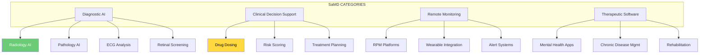

#### SaMD Recall Trends

| Year | SaMD Recalls | % of Total | Trend |
|------|--------------|------------|-------|
| 2020 | ~85 | 10% | Baseline |
| 2021 | ~130 | 14% | +53% |
| 2022 | ~180 | 20% | +38% |
| 2023 | ~250 | 26% | +39% |
| 2024 | ~380 | 35% | +52% |

#### SaMD-Specific Recall Causes

| Cause | % | Examples |
|-------|---|----------|
| Algorithm errors | 28% | Incorrect calculations, classification errors |
| Display/UI bugs | 22% | Missing data, wrong patient |
| Integration failures | 18% | EHR connectivity, data parsing |
| Cybersecurity | 15% | Vulnerabilities, unauthorized access |
| Update/version issues | 12% | Regression bugs, compatibility |
| Data handling | 5% | Corruption, loss, privacy |

#### Cybersecurity-Related Recalls

Notable cybersecurity-driven recalls:

| Year | Device Type | Issue |
|------|-------------|-------|
| 2017 | Pacemakers | Remote access vulnerability (465K units) |
| 2019 | Infusion pumps | Network vulnerability |
| 2021 | Insulin pumps | Bluetooth security |
| 2023 | Patient monitors | Unauthorized access risk |
| 2024 | Multiple | SBOM/component vulnerabilities |

#### FDA AI/ML Device Statistics

| Metric | Value |
|--------|-------|
| Authorized AI/ML devices (July 2025) | 1,250+ |
| Authorized AI/ML devices (Aug 2024) | 950 |
| Growth rate | ~30% annually |
| Recall rate for AI/ML devices | ~9.4% |
| Radiology AI (% of total AI devices) | ~75% |

---

### 8. Surgical Devices

**Recall Statistics**: 7% of Class I recalls

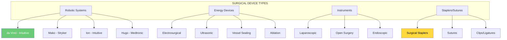

#### Surgical Stapler Recalls

Surgical staplers have been a significant focus:

| Issue | Impact |
|-------|--------|
| Malformation | Inadequate tissue approximation |
| Misfiring | Incomplete staple deployment |
| Tissue damage | Adjacent structure injury |

FDA issued a letter to healthcare providers in 2019 highlighting stapler-related adverse events.

#### Robotic Surgery Recalls

| System | Company | Common Issues |
|--------|---------|---------------|
| da Vinci | Intuitive | Instrument arm, software |
| Mako | Stryker | Navigation, software |
| ROSA | Zimmer Biomet | Software, calibration |
| Ion | Intuitive | Catheter, software |

---

## Cross-Category Analysis

### Recall Causes by Category

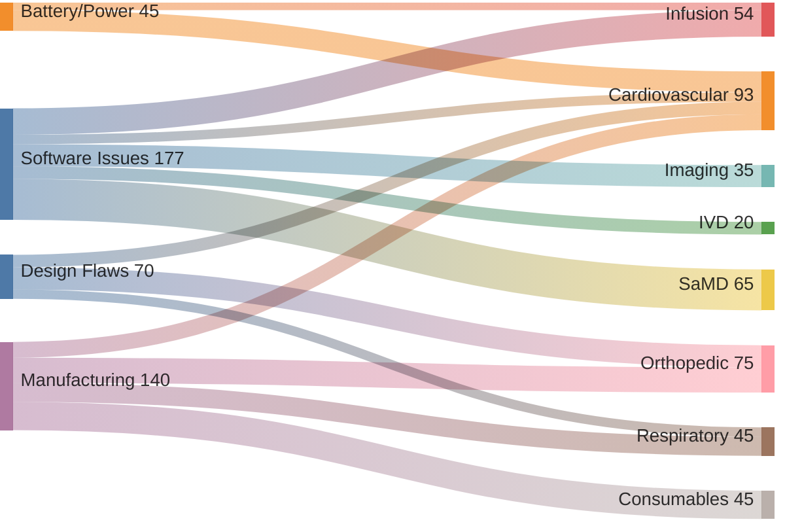

### Root Cause Distribution by Category

| Root Cause | CV | Resp | Infusion | Ortho | Imaging | IVD |
|------------|-----|------|----------|-------|---------|-----|
| Software | 15% | 20% | 42% | 5% | 35% | 20% |
| Manufacturing | 25% | 30% | 15% | 40% | 15% | 25% |
| Design | 20% | 15% | 18% | 35% | 20% | 10% |
| Materials | 10% | 25% | 8% | 15% | 5% | 15% |
| Battery/Power | 33% | 5% | 12% | 0% | 10% | 5% |
| Labeling | 5% | 5% | 5% | 5% | 10% | 15% |

### Time to Recall by Category

| Category | Avg. Time to Detection | Factors |
|----------|----------------------|---------|
| Cardiovascular | 2-5 years | Long implant life, subtle failures |
| Orthopedic | 3-10 years | Wear patterns, revision data |
| Respiratory | 1-3 years | Usage frequency, patient reports |
| Infusion | 6-18 months | Continuous monitoring, alarms |
| Imaging | 1-2 years | Service data, image quality |
| IVD | 3-12 months | QC data, proficiency testing |
| SaMD | 1-6 months | Usage analytics, error logs |

## RecallWire Implications

### Feature Prioritization by Category

| Category | Key Features Needed |
|----------|-------------------|
| Cardiovascular | Patient registry integration, long-term tracking |
| Respiratory | Mass notification, unit volume handling |
| Infusion | Serial number matching, software version tracking |
| Orthopedic | Surgical log integration, multi-year tracking |
| Imaging | Service contract integration, workflow scheduling |
| IVD | Lot tracking, lab system integration |
| SaMD | Version management, deployment tracking |

### Target Customer Priorities

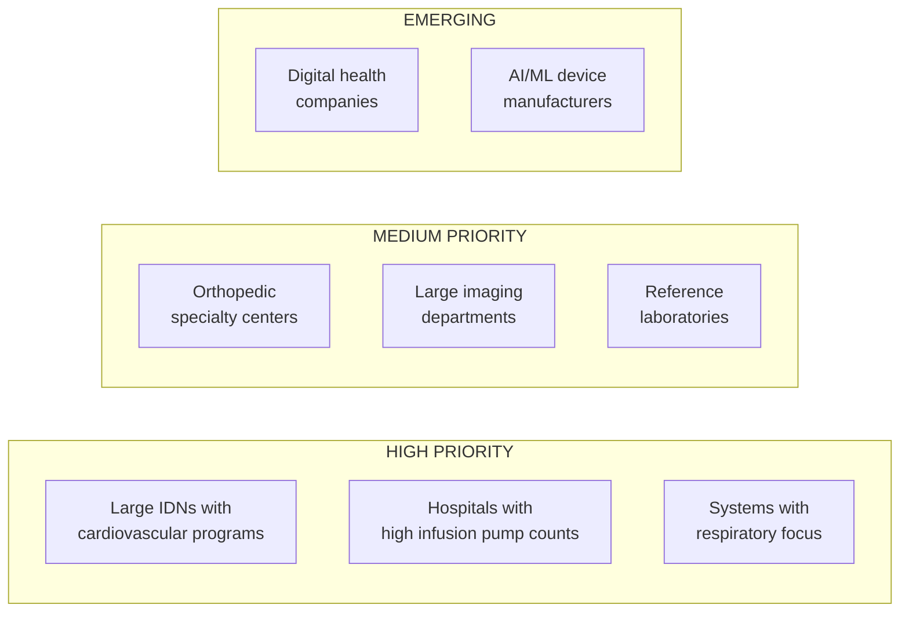

## Sources

- [FDA 2024 Medical Device Recalls](https://www.fda.gov/medical-devices/medical-device-recalls/2024-medical-device-recalls)
- [MedTech Dive: Medical Device Recalls 2024](https://www.medtechdive.com/news/medical-device-recalls-roundup-2024/736038/)
- [Drug and Device World: Most Recalled Devices 2024-2025](https://druganddeviceworld.com/2025/05/02/most-recalled-medical-devices-and-manufacturers-in-2024-2025/)
- [UL Solutions: Medical Device Recalls Key Trends 2024](https://www.ul.com/insights/medical-device-recalls-key-trends-2024)
- [PMC: Comprehensive Analysis of Class I Recalls](https://pmc.ncbi.nlm.nih.gov/articles/PMC11416579/)
- [PMC: Recalls of Cardiac Implants](https://pmc.ncbi.nlm.nih.gov/articles/PMC4427435/)
- [PMC: Orthopedic Implant Recalls](https://pmc.ncbi.nlm.nih.gov/articles/PMC11572424/)
- [PMC: Hazard Analysis of Infusion Pump Recalls](https://pmc.ncbi.nlm.nih.gov/articles/PMC6524450/)
- [STAT News: Cardiovascular Device Recalls](https://www.statnews.com/2024/09/16/cardiovascular-medical-devices-safety-recall-fda-510k-pathway/)
- [Harvard Health: Cardiac Device Recalls](https://www.health.harvard.edu/heart-health/what-you-should-know-about-recalls-of-cardiac-devices)
- [FDA: Exactech Safety Communication](https://www.fda.gov/medical-devices/safety-communications/risks-exactech-joint-replacement-devices-defective-packaging-fda-safety-communication)
- [FDA: Cybersecurity Guidance](https://www.fda.gov/medical-devices/digital-health-center-excellence/cybersecurity)
