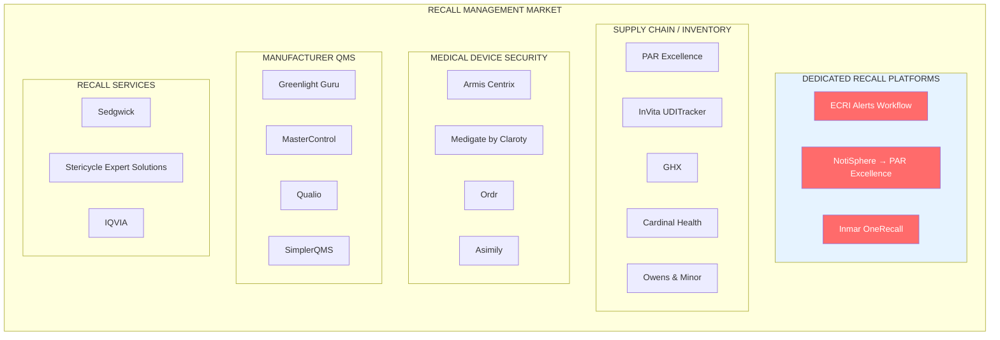
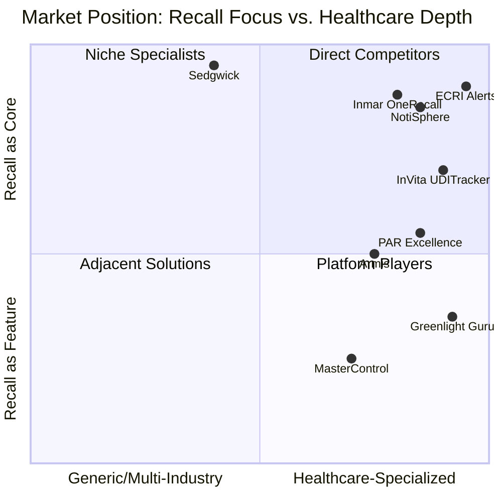
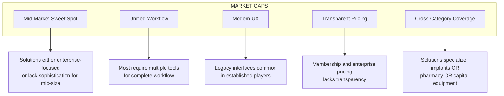
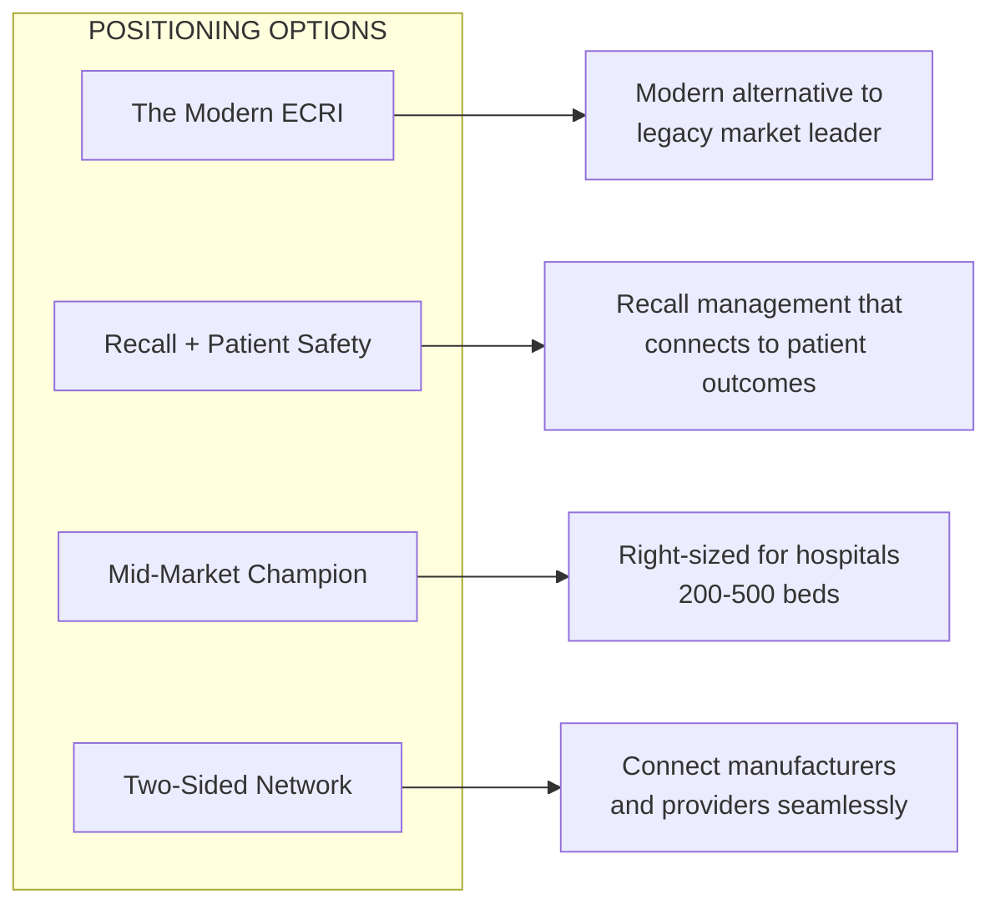

# Competitive Landscape: Recall Management Solutions

## Overview

The medical device recall management market is fragmented across multiple solution categories, from dedicated recall platforms to broader supply chain and quality management systems. This document maps the competitive landscape to inform RecallWire's positioning and differentiation strategy.

## Market Structure

## Competitor Categories

### 1. Dedicated Recall Management Platforms

These are the primary direct competitors - purpose-built solutions for healthcare providers to manage incoming recalls.

---

#### ECRI Alerts Workflow

**Company Profile**
| Attribute | Details |
|-----------|---------|
| **Company** | ECRI (formerly Emergency Care Research Institute) |
| **Founded** | 1968 |
| **Type** | Independent nonprofit |
| **HQ** | Plymouth Meeting, PA |
| **Members/Clients** | 5,000+ |
| **Status** | Market leader |

**Product Overview**

ECRI's Alerts Workflow is the most established recall management solution in healthcare, built on 50+ years of medical device safety expertise.

**Key Features**
| Feature | Description |
|---------|-------------|
| **Early Alerts** | Notifies users days/weeks/months ahead of FDA |
| **AutoMatch** | Automatically matches recalls to inventory |
| **Multi-Department** | Supply chain, clinical engineering, IT, pharmacy, lab |
| **Personalized Dashboards** | Real-time tracking across facilities |
| **Workday Integration** | Only solution with native Workday connector |

**Strengths**
- Industry-leading alert timeliness (ahead of FDA)
- 50+ years of credibility in patient safety
- WHO Collaborating Center designation
- Comprehensive device database
- 95% membership renewal rate
- Members report 50-90% reduction in resolution times

**Weaknesses**
- Nonprofit model may limit R&D investment
- Membership-based pricing less transparent
- Legacy technology stack
- Bundled with other ECRI services (may be overkill for smaller orgs)

**Pricing Model**
- Membership-based (not publicly disclosed)
- Typically bundled with other ECRI services (PriceGuide, device evaluations)
- Contact required for quotes

**Target Customers**
- Large health systems and IDNs
- Academic medical centers
- GPO members

---

#### NotiSphere (Acquired by PAR Excellence)

**Company Profile**
| Attribute | Details |
|-----------|---------|
| **Company** | NotiSphere, Inc. (now part of PAR Excellence) |
| **Acquisition** | January 2025 |
| **Focus** | Recall notification communications |
| **Model** | Two-sided platform (providers + manufacturers) |

**Product Overview**

NotiSphere pioneered a communications platform connecting healthcare providers directly with medical device manufacturers for recall notifications.

**Key Features**
| Feature | Description |
|---------|-------------|
| **Two-Sided Network** | Connects providers and manufacturers |
| **Alert Filtering** | Only 2.5% of alerts apply to typical client |
| **Electronic Connectivity** | Replaces mail/fax with digital |
| **Backorder/Shortage Tracking** | Beyond recalls |
| **Manufacturer Portal** | Proactive alert delivery |

**Strengths**
- Network effects (both sides of market)
- Reduces noise (filters irrelevant recalls)
- Modern cloud architecture
- Strong customer advocacy (open letter campaign)
- Now backed by PAR Excellence resources

**Weaknesses**
- Acquired - integration uncertainty
- Dependent on manufacturer adoption
- Less comprehensive device database than ECRI
- Limited patient identification features

**Notable Customers**
- BJC Healthcare
- Froedtert
- Children's Hospital Los Angeles
- Phoenix Children's Hospital
- UC Davis Health
- Valley Children's Hospital

**Pricing Model**
- Not publicly disclosed
- Likely SaaS subscription

---

#### Inmar OneRecall

**Company Profile**
| Attribute | Details |
|-----------|---------|
| **Company** | Inmar Intelligence |
| **Founded** | 1980 |
| **Focus** | Healthcare supply chain, returns, recalls |
| **HQ** | Winston-Salem, NC |
| **Market Position** | 60% of US hospitals |

**Product Overview**

OneRecall is the only fully integrated offering facilitating every stage of the recall process, with particular strength in pharmacy/medication recalls.

**Key Features**
| Feature | Description |
|---------|-------------|
| **RapidID Technology** | Compares purchase history to recalls automatically |
| **TraySafe** | Kit/tray management with image recognition |
| **TraySafe Mobile** | Tablet-based tray processing |
| **RxTransparent** | Real-time alert filtering |
| **Returns Management** | End-to-end credit recovery |

**Strengths**
- 60% US hospital market share
- 18/22 top US News Honor Roll hospitals
- Strong pharmacy/medication focus
- Image recognition technology (not RFID-dependent)
- Returns/credit management integration

**Weaknesses**
- Primarily pharmacy-focused (less emphasis on devices)
- Legacy company culture
- Less modern UX than newer entrants

**Pricing Model**
- Not publicly disclosed
- Enterprise contracts

---

### 2. Supply Chain & Inventory Platforms

These solutions include recall management as part of broader supply chain capabilities.

---

#### PAR Excellence

**Company Profile**
| Attribute | Details |
|-----------|---------|
| **Company** | PAR Excellence Systems |
| **HQ** | Blue Ash, OH |
| **Clients** | 1,700+ healthcare organizations |
| **Inventory Under Management** | $2 billion |
| **Integrations** | 2,400+ with EHRs/ERPs |

**Product Overview**

PAR Excellence is a supply chain data intelligence platform that unifies inventory management, clinical optimization, and workforce solutions.

**Key Features**
| Feature | Description |
|---------|-------------|
| **Recall Management** | Track and manage product recalls |
| **Tissue & Implant Management** | Comprehensive tracking |
| **RFID Technology** | Real-time inventory tracking |
| **Warranty Tracking** | Equipment lifecycle management |
| **2 million scales** | Physical inventory automation |

**Strengths**
- Massive scale (1,700+ clients, $2B inventory)
- NotiSphere acquisition strengthens recall capabilities
- Deep EHR/ERP integrations (2,400+)
- Physical + digital tracking
- Boston Children's, Seattle Children's, VA as customers

**Weaknesses**
- Recall is one feature among many
- May be overkill for recall-only needs
- Enterprise sales cycle

---

#### InVita Healthcare Technologies (UDITracker)

**Company Profile**
| Attribute | Details |
|-----------|---------|
| **Company** | InVita Healthcare Technologies |
| **Product** | UDITracker / Implant360 |
| **Customers** | 700+ hospitals and surgery centers |
| **Focus** | Tissue and implant tracking |

**Product Overview**

UDITracker is the leading solution for tissue and implant lifecycle management, with strong recall matching capabilities.

**Key Features**
| Feature | Description |
|---------|-------------|
| **RecallConnect** | Real-time recall-to-patient matching |
| **FDA Database Integration** | Automatic recall data import |
| **EHR Integration** | Epic, Cerner connectivity |
| **GS1 Barcode Scanning** | UDI compliance |
| **Explant Tracking** | Full lifecycle management |

**Strengths**
- Chicago Innovation Award winner (RecallConnect)
- Reduces patient identification from months to hours
- Only solution with GS1 barcode capabilities
- Strong regulatory compliance (JCAHO, FDA, DNV)
- 700+ customer base

**Weaknesses**
- Focused on implants/tissue (not all device types)
- Less comprehensive for non-implantable devices
- Requires EHR integration

**Pricing Model**
- Not publicly disclosed
- Per-facility licensing likely

---

### 3. Medical Device Security Platforms

These solutions approach recalls from a cybersecurity/asset management angle.

---

#### Armis Centrix

**Company Profile**
| Attribute | Details |
|-----------|---------|
| **Company** | Armis |
| **Founded** | 2015 |
| **Valuation** | $3.4B (2024) |
| **Focus** | Asset intelligence, IoMT security |
| **Recognition** | KLAS #1 cross-industry vendor (2023) |

**Product Overview**

Armis Centrix provides comprehensive medical device security with integrated FDA recall and security advisory management.

**Key Features**
| Feature | Description |
|---------|-------------|
| **Device Discovery** | Find unknown devices on network |
| **FDA Recall Tracking** | Identify devices with active recalls |
| **Class 1/2/3 Visibility** | Prioritize by recall severity |
| **Security Advisory Management** | Cybersecurity vulnerability tracking |
| **Weekly Progress Reports** | Automated tracking |

**Strengths**
- Strong cybersecurity pedigree
- Agentless device discovery
- Combined recall + security view
- Large healthcare customer base
- University Health Network (Canada's largest) as customer

**Weaknesses**
- Security-first, recall-second mindset
- Higher price point (cybersecurity budgets)
- Less focus on supply chain workflows
- May miss non-networked devices

**Pricing Model**
- Enterprise security pricing
- Per-device or per-bed models common

---

#### Other Security Platforms

| Platform | Parent | Focus | Recall Features |
|----------|--------|-------|-----------------|
| **Medigate** | Claroty | Clinical device security | FDA recall visibility |
| **Ordr** | Ordr | IoT security | Asset inventory |
| **Asimily** | Asimily | Medical device risk | Vulnerability + recall |
| **Cynerio** | Cynerio | Healthcare IoT | Device tracking |

---

### 4. Manufacturer QMS Solutions

These solutions help manufacturers manage their quality processes, including recall execution.

---

#### Greenlight Guru

**Company Profile**
| Attribute | Details |
|-----------|---------|
| **Company** | Greenlight Guru |
| **Founded** | 2013 |
| **HQ** | Indianapolis, IN |
| **Focus** | Medical device QMS |
| **Position** | #1 QMS for medical devices |

**Product Overview**

Greenlight Guru is a cloud-based QMS purpose-built for medical device companies, emphasizing proactive quality management to prevent recalls.

**Key Features**
| Feature | Description |
|---------|-------------|
| **Design Controls** | FDA 21 CFR 820 compliance |
| **Risk Management** | ISO 14971 alignment |
| **CAPA Management** | Corrective action workflows |
| **Complaint Management** | Postmarket surveillance |
| **AI Document Analysis** | Impact identification |

**Strengths**
- Purpose-built for medical devices
- Modern cloud architecture
- Strong regulatory compliance (FDA, ISO 13485)
- Proactive prevention focus
- Growing customer base

**Weaknesses**
- Manufacturer-focused (not provider)
- Not a recall management tool per se
- Doesn't help hospitals manage incoming recalls

**RecallWire Relevance**
- Potential integration partner (manufacturer side)
- Not a direct competitor

---

#### Other Manufacturer QMS

| Platform | Target Market | Pricing | Key Differentiator |
|----------|---------------|---------|-------------------|
| **MasterControl** | Large enterprises | Enterprise ($$$) | Comprehensive, AI-driven |
| **Qualio** | SMB life sciences | $12K + $3K/user/yr | Ease of use, modern UX |
| **SimplerQMS** | Life sciences | Mid-market | Microsoft integration |
| **Veeva Vault** | Enterprise | Enterprise ($$$) | Industry standard |
| **Arena Solutions** | Mid-market | Mid-market | PLM + QMS |

---

### 5. Recall Services & Consulting

These companies provide recall execution services rather than software.

---

#### Sedgwick

**Company Profile**
| Attribute | Details |
|-----------|---------|
| **Company** | Sedgwick |
| **Experience** | 30+ years, 7,000+ recall events |
| **Coverage** | 150 countries, 50 languages |
| **Industries** | Food, medical devices, consumer products, pharma |

**Client Relationships**
- 7/10 world's leading medical device brands
- 9/10 world's leading pharmaceutical brands
- 8/10 world's leading food and drink brands

**Services**
| Service | Description |
|---------|-------------|
| **Recall Planning** | Mock exercises, vulnerability assessment |
| **Contact Center** | Multi-channel, multilingual support |
| **Fulfillment** | Replacements, repairs, reimbursements |
| **Communications** | Consumer notification |
| **Regulatory Support** | FDA/international compliance |

**RecallWire Relevance**
- Potential partner (services complement software)
- Serves manufacturers, not providers
- Not a direct competitor

---

## Competitive Positioning Map

## Feature Comparison Matrix

### Provider-Focused Solutions

| Feature | ECRI | NotiSphere | Inmar | InVita | PAR | Armis |
|---------|------|------------|-------|--------|-----|-------|
| **Recall Alerts** | ✅ Early | ✅ | ✅ | ✅ | ✅ | ✅ |
| **Inventory Matching** | ✅ AutoMatch | ⚠️ | ✅ RapidID | ✅ | ✅ | ✅ |
| **Patient ID (Implants)** | ⚠️ | ❌ | ❌ | ✅ Best | ✅ | ❌ |
| **EHR Integration** | ✅ Workday | ⚠️ | ⚠️ | ✅ Epic/Cerner | ✅ | ⚠️ |
| **Multi-Department** | ✅ | ✅ | ✅ Pharmacy | ⚠️ Surgery | ✅ | ✅ IT/Biomed |
| **Manufacturer Network** | ❌ | ✅ Both sides | ✅ | ✅ | ⚠️ | ❌ |
| **Cybersecurity Recalls** | ⚠️ | ❌ | ❌ | ❌ | ❌ | ✅ Best |
| **Kit/Tray Mgmt** | ❌ | ❌ | ✅ TraySafe | ❌ | ⚠️ | ❌ |
| **Mobile App** | ⚠️ | ⚠️ | ✅ | ⚠️ | ⚠️ | ✅ |
| **Analytics/Reporting** | ✅ | ✅ | ✅ | ✅ | ✅ | ✅ |

**Legend**: ✅ = Strong | ⚠️ = Partial/Basic | ❌ = Not Available

## Pricing Landscape

| Solution | Model | Estimated Range | Notes |
|----------|-------|-----------------|-------|
| **ECRI** | Membership | $50K-$500K+/yr | Bundled with other services |
| **NotiSphere** | SaaS | Unknown | Per-facility likely |
| **Inmar OneRecall** | Enterprise | $25K-$200K+/yr | Volume-based |
| **InVita UDITracker** | Per-facility | $15K-$100K+/yr | Based on case volume |
| **PAR Excellence** | Platform | $50K-$500K+/yr | Comprehensive platform |
| **Armis** | Per-device | $5-$15/device/yr | Security pricing |
| **Greenlight Guru** | SaaS | $25K-$150K+/yr | Per-user component |

*Note: Pricing is estimated based on industry benchmarks and should be verified.*

## Market Gaps & Opportunities

### Identified Gaps

### Opportunity Areas for RecallWire

| Opportunity | Current Gap | RecallWire Approach |
|-------------|-------------|---------------------|
| **Mid-Market Focus** | Enterprise solutions too complex; basic tools insufficient | Right-sized solution for 200-500 bed hospitals |
| **Unified Platform** | Fragmented across implants, devices, medications | Single platform for all recall types |
| **Modern Experience** | Legacy UX in market leaders | Clean, intuitive interface |
| **Transparent Pricing** | Opaque membership/enterprise models | Published per-bed or per-facility pricing |
| **Quick Implementation** | 6-12 month enterprise deployments | Weeks, not months |
| **Manufacturer Network** | Limited two-sided platforms | Build network effects |

## Competitive Differentiation Strategy

### Positioning Options

### Recommended Differentiation

| Differentiator | How to Execute |
|----------------|----------------|
| **Speed to Value** | Self-service onboarding, pre-built integrations |
| **All Device Types** | Implants, capital, consumables, software in one platform |
| **Patient Safety Focus** | Clear connection between recall response and patient outcomes |
| **Regulatory Readiness** | Built-in Joint Commission, FDA compliance reporting |
| **Modern Technology** | API-first, cloud-native, mobile-ready |
| **Transparent Pricing** | Published pricing, no "contact sales" barriers |

## Partnership Opportunities

### Integration Partners

| Partner Type | Examples | Value |
|--------------|----------|-------|
| **EHR Vendors** | Epic, Oracle Cerner, Meditech | Patient data for implant recalls |
| **ERP/MMIS** | Workday, Infor, Oracle | Inventory matching |
| **Device Manufacturers** | Top 20 by recall volume | Two-sided network |
| **GPOs** | Vizient, Premier, HealthTrust | Distribution channel |

### Service Partners

| Partner Type | Examples | Value |
|--------------|----------|-------|
| **Recall Services** | Sedgwick, Stericycle | Fulfillment, contact centers |
| **Consulting** | KPMG, Deloitte (healthcare) | Implementation, change mgmt |
| **Compliance** | ECRI (coopetition), DNV | Credibility, certification |

## Key Takeaways

1. **Market Leader is Vulnerable**: ECRI has dominant position but legacy technology and nonprofit model create opening

2. **Consolidation Happening**: PAR Excellence + NotiSphere signals market maturation

3. **Fragmentation Creates Opportunity**: No single solution covers all recall types well

4. **Pricing Opacity is Universal**: Transparent pricing would be differentiating

5. **Patient Safety Underserved**: Most solutions focus on compliance, not outcomes

6. **Mid-Market Overlooked**: Solutions either too complex (enterprise) or too basic

## Sources

- [ECRI Alerts Workflow](https://home.ecri.org/pages/ecri-alerts-workflow-automated-recall-management-software)
- [NotiSphere](https://www.notisphere.com/)
- [PAR Excellence Acquires NotiSphere](https://www.businesswire.com/news/home/20250121149575/en/PAR-Excellence-Systems-Acquires-NotiSphere-Inc.)
- [PAR Excellence](https://parexcellence.com/)
- [Inmar OneRecall](https://www.inmar.com/solutions/healthcare/onerecall-recall-management/onerecall-overview)
- [InVita UDITracker](https://www.invitahealth.com/solutions/tissue-implant-explant-management/uditracker/)
- [Armis FDA Recall Management](https://www.armis.com/solutions/fda-recall-and-security-advisories-management/)
- [Greenlight Guru](https://www.greenlight.guru/)
- [Greenlight Guru: FDA Recall Guidance](https://www.greenlight.guru/blog/fda-medical-device-recalls)
- [Sedgwick Recall Services](https://www.sedgwick.com/product-recall/)
- [Sedgwick Medical Device Recalls](https://www.sedgwick.com/product-recall/industries/medical-device/)
- [ECRI Workday Integration](https://marketplace.workday.com/en-US/apps/452476/ecri-recall-management-integration/overview)
- [QMS Software Comparison](https://openregulatory.com/articles/qms-software-iso-13485-comparison)
