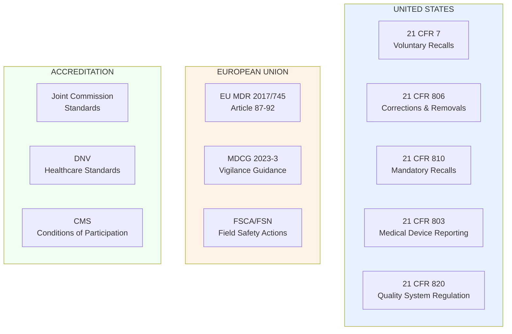
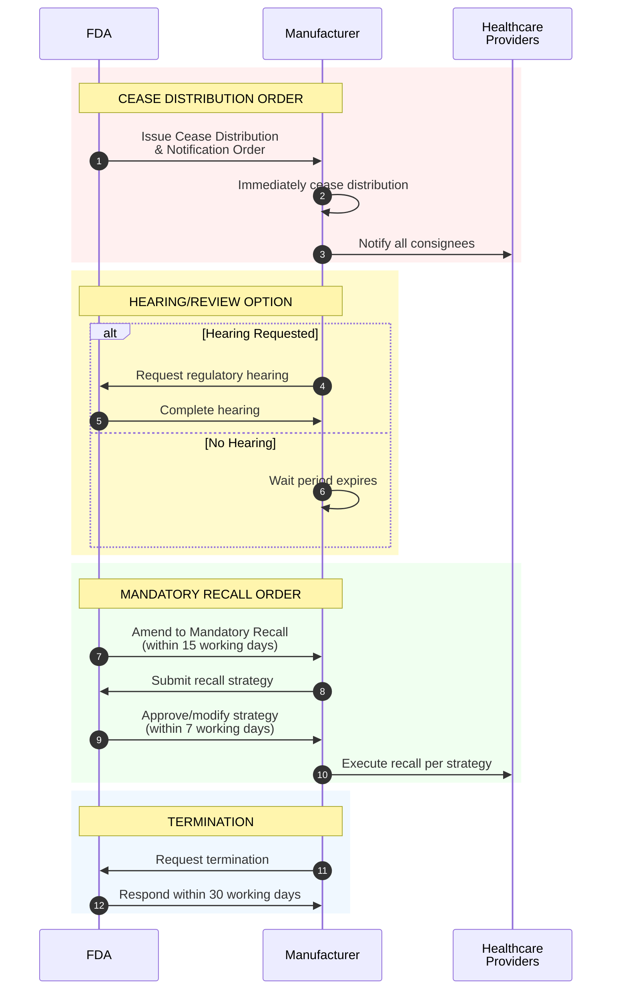
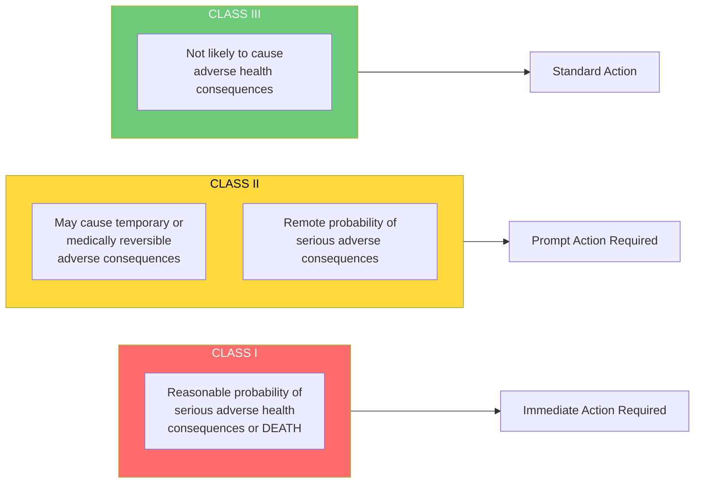
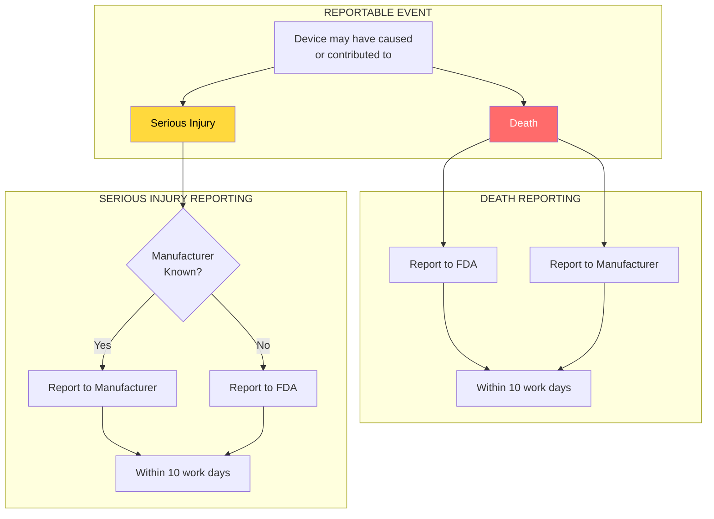
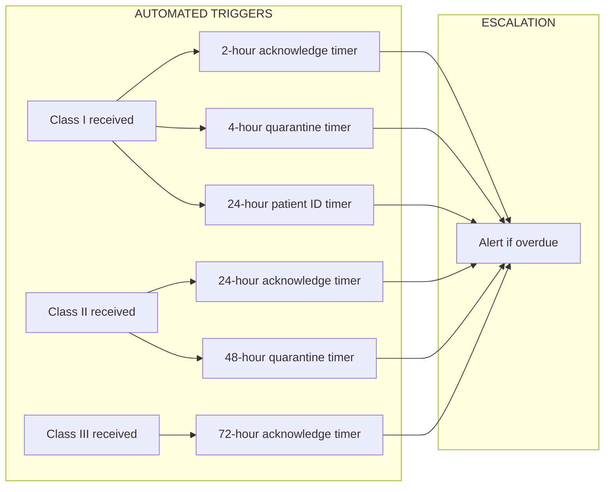

# Regulatory Timeline: Medical Device Recall Requirements

## Overview

This document outlines the regulatory requirements, reporting deadlines, and compliance timelines for medical device recalls. Understanding these requirements is critical for RecallWire to help healthcare providers and manufacturers meet their obligations.

## Regulatory Framework

## Key Regulatory Codes (US)

| Code | Title | Scope | Primary Requirements |
|------|-------|-------|---------------------|
| **21 CFR 7** | Enforcement Policy | Voluntary recalls | Recall strategy, classification, effectiveness |
| **21 CFR 803** | Medical Device Reporting | Adverse events | Death, injury, malfunction reporting |
| **21 CFR 806** | Reports of Corrections/Removals | Recall reporting | 10-day reporting requirement |
| **21 CFR 810** | Medical Device Recall Authority | Mandatory recalls | FDA-ordered recalls |
| **21 CFR 820** | Quality System Regulation | Quality management | Procedures, documentation, CAPA |

---

## Manufacturer Reporting Timelines

### Medical Device Reporting (MDR) - 21 CFR 803

```mermaid
gantt
    title MDR Reporting Timelines
    dateFormat  X
    axisFormat %d days

    section Death/Serious Injury
    Become Aware           :milestone, m1, 0, 0
    Standard Report Due    :active, a1, 0, 30

    section Remedial Action Needed
    Become Aware           :milestone, m2, 0, 0
    5-Day Report Due       :crit, c1, 0, 5

    section Malfunction
    Become Aware           :milestone, m3, 0, 0
    Standard Report Due    :a2, 0, 30
```

| Event Type | Timeline | Regulation | Notes |
|------------|----------|------------|-------|
| **Death** | 30 calendar days | 21 CFR 803.50 | From awareness |
| **Serious Injury** | 30 calendar days | 21 CFR 803.50 | From awareness |
| **Malfunction** | 30 calendar days | 21 CFR 803.50 | If could cause death/injury |
| **Remedial Action Needed** | 5 calendar days | 21 CFR 803.53 | Unreasonable risk to public health |
| **FDA-Requested 5-Day** | 5 calendar days | 21 CFR 803.53 | When FDA specifically requests |

### Corrections and Removals - 21 CFR 806

| Requirement | Timeline | Details |
|-------------|----------|---------|
| **Report to FDA** | 10 working days | From initiating correction/removal |
| **Status Reports** | Every 2-4 weeks | Progress updates to FDA |
| **Records Retention** | Shelf life + use period | Minimum per other applicable regs |

### Report Contents (21 CFR 806.10)

Required information in correction/removal reports:

| Element | Description |
|---------|-------------|
| Registration number | Firm's FDA registration |
| Report date | Date of submission |
| Sequence number | Unique report identifier |
| Action type | "C" for correction, "R" for removal |
| Firm information | Name, address, contact person, phone |
| Device identification | Brand name, common name, listing number |
| Marketing status | 510(k), PMA, or preamendment |
| Event description | What happened and why |
| Corrective actions | What is being done |

---

## FDA Mandatory Recall Process (21 CFR 810)

When manufacturers fail to voluntarily recall dangerous devices, FDA can order mandatory recalls.

### Mandatory Recall Timelines

| Phase | Timeline | Requirement |
|-------|----------|-------------|
| **Cease Distribution** | Immediate | Upon order issuance |
| **Consignee Notification** | Immediate | Verified written communication |
| **Amendment to Mandatory Recall** | 15 working days | After order or hearing |
| **Strategy Review** | 7 working days | FDA reviews proposed strategy |
| **Termination Response** | 30 working days | FDA responds to termination request |

### Communication Requirements

Mandatory recall communications must be:
- **Verified written communication** (telegram, fax, certified mail)
- **Conspicuously marked** in bold red ink
- Labeled: "URGENT—MANDATORY DEVICE RECALL ORDER"

---

## Recall Classifications & Depth

### Recall Classes

### Recall Depth

| Depth Level | Definition | Example |
|-------------|------------|---------|
| **Consumer/User** | All levels including end users | Patient notification for implants |
| **Retail** | To the retail level | Hospital/clinic level |
| **Wholesale** | Wholesale distributors only | GPO/distributor level |

### Effectiveness Check Levels

| Level | Contact Rate | Typical Use |
|-------|--------------|-------------|
| **Level A** | 100% of consignees | Class I, life-threatening |
| **Level B** | >10% to <100% | Case-by-case determination |
| **Level C** | 10% of consignees | Moderate risk |
| **Level D** | 2% of consignees | Lower risk |
| **Level E** | No direct contact | Based on distribution data |

---

## User Facility Requirements (Hospitals)

Hospitals are "user facilities" under FDA regulations and have specific reporting obligations.

### Hospital MDR Reporting (21 CFR 803)

| Event | Report To | Timeline | Form |
|-------|-----------|----------|------|
| **Death** | FDA AND Manufacturer | 10 work days | FDA Form 3500A |
| **Serious Injury** | Manufacturer (or FDA if unknown) | 10 work days | FDA Form 3500A |
| **Malfunction** | Not required for user facilities | N/A | N/A |

### Annual Summary (User Facilities)

User facilities must submit annual summaries of MDR reports:
- **Due Date**: January 1 each year
- **Content**: Summary of all reports submitted previous year
- **Form**: FDA Form 3419

---

## EU MDR Vigilance Requirements

### Serious Incident Reporting Timelines

```mermaid
gantt
    title EU MDR Reporting Timelines
    dateFormat  X
    axisFormat %d days

    section Public Health Threat
    Become Aware           :milestone, m1, 0, 0
    Report Due             :crit, c1, 0, 2

    section Death/Serious Deterioration
    Become Aware           :milestone, m2, 0, 0
    Report Due             :active, a1, 0, 10

    section Other Serious Incident
    Become Aware           :milestone, m3, 0, 0
    Report Due             :a2, 0, 15
```

| Event Type | Timeline | Regulation |
|------------|----------|------------|
| **Serious Public Health Threat** | 2 days maximum | MDR Article 87(2) |
| **Death or Unanticipated Serious Deterioration** | 10 days maximum | MDR Article 87(3) |
| **Other Serious Incident** | 15 days maximum | MDR Article 87(4) |
| **Similar Incidents (Trending)** | Per trend report schedule | MDR Article 87(9) |

### Field Safety Corrective Action (FSCA)

| Requirement | Timeline | Notes |
|-------------|----------|-------|
| **FSCA Report** | "Without undue delay" | No specific timeline in MDR |
| **Field Safety Notice (FSN)** | "Without delay" | To affected users |
| **EUDAMED Upload** | Upon issuance | FSN must be uploaded |
| **CA Notification** | Concurrent with FSCA | All affected member states |

### FSCA Types

| Action Type | Description |
|-------------|-------------|
| **Return/Recall** | Device returned to manufacturer |
| **Exchange** | Device replaced with corrected unit |
| **Modification** | On-site repair or update |
| **Retrofit** | Purchaser installs manufacturer modification |
| **Destruction** | Device permanently disabled/destroyed |

---

## Accreditation Requirements

### Joint Commission Standards

| Requirement Area | Standard | Key Elements |
|------------------|----------|--------------|
| **Environment of Care** | EC.02.01.01 | Manage safety and security risks |
| **Medication Management** | MM.03.01.01 | Safe medication handling |
| **Infection Prevention** | IC.02.02.01 | Reduce infection risks |
| **Patient Safety Systems** | PS Chapter | Proactive safety approach |

### Accreditation Consequences

| Days Non-Compliant | Status |
|--------------------|--------|
| 0-30 days | Time to correct |
| 31-60 days | Provisional Accreditation |
| 61-90 days | Conditional Accreditation |
| 91+ days | Denial of Accreditation |

### CMS Conditions of Participation

Hospitals must comply with CMS CoP to receive Medicare/Medicaid reimbursement:

| Condition | Relevance to Recalls |
|-----------|---------------------|
| **42 CFR 482.41** | Physical environment safety |
| **42 CFR 482.42** | Infection control |
| **42 CFR 482.21** | Quality assessment and performance improvement |

---

## Hospital Response Timeline Best Practices

### Recommended Response Times by Recall Class

```mermaid
flowchart TD
    subgraph ClassI["CLASS I RECALL"]
        I1[Receive Notification] --> I2[Acknowledge<br/>within 2 hours]
        I2 --> I3[Quarantine inventory<br/>within 4 hours]
        I3 --> I4[Patient identification<br/>within 24 hours]
        I4 --> I5[Patient notification<br/>within 48-72 hours]
        I5 --> I6[Resolution<br/>within 2 weeks]
    end

    subgraph ClassII["CLASS II RECALL"]
        II1[Receive Notification] --> II2[Acknowledge<br/>within 24 hours]
        II2 --> II3[Quarantine inventory<br/>within 48 hours]
        II3 --> II4[Patient identification<br/>within 1 week]
        II4 --> II5[Resolution<br/>within 4 weeks]
    end

    subgraph ClassIII["CLASS III RECALL"]
        III1[Receive Notification] --> III2[Acknowledge<br/>within 72 hours]
        III2 --> III3[Assess applicability<br/>within 1 week]
        III3 --> III4[Resolution<br/>within 8 weeks]
    end

    style I1 fill:#ff6b6b,color:#fff
    style II1 fill:#ffd93d,color:#000
    style III1 fill:#6bcb77,color:#fff
```

### Detailed Timeline by Recall Class

#### Class I Recalls

| Phase | Target Timeline | Activities |
|-------|-----------------|------------|
| **Immediate** | 0-2 hours | Acknowledge receipt, alert leadership |
| **Urgent** | 2-4 hours | Quarantine all affected inventory |
| **Same Day** | 4-8 hours | Notify clinical departments, suspend use |
| **24 Hours** | Day 1 | Begin patient identification |
| **48-72 Hours** | Days 2-3 | Patient notification begins |
| **1 Week** | Day 7 | Complete patient identification |
| **2 Weeks** | Day 14 | Corrective action substantially complete |
| **30 Days** | Day 30 | Full documentation and closure |

#### Class II Recalls

| Phase | Target Timeline | Activities |
|-------|-----------------|------------|
| **Day 1** | 24 hours | Acknowledge receipt, assess scope |
| **Day 2-3** | 48-72 hours | Quarantine affected inventory |
| **Week 1** | 7 days | Complete inventory assessment |
| **Week 2** | 14 days | Patient identification if needed |
| **Week 4** | 28 days | Corrective action complete |
| **Week 6** | 42 days | Documentation and closure |

#### Class III Recalls

| Phase | Target Timeline | Activities |
|-------|-----------------|------------|
| **Week 1** | 7 days | Acknowledge and assess applicability |
| **Week 2-4** | 14-28 days | Implement corrections |
| **Week 8** | 56 days | Documentation and closure |

---

## Documentation Requirements

### Required Records

| Document | Retention Period | Purpose |
|----------|------------------|---------|
| **Recall Notification** | 10+ years | Proof of receipt |
| **Inventory Search Results** | 10+ years | Due diligence |
| **Quarantine Records** | 10+ years | Chain of custody |
| **Patient Identification** | Permanent | Medical record |
| **Patient Notification** | Permanent | Legal protection |
| **Corrective Actions** | 10+ years | Compliance proof |
| **Closure Documentation** | 10+ years | Regulatory compliance |

### Audit Trail Elements

| Element | Requirement |
|---------|-------------|
| **Date/Time Stamps** | All actions logged with timestamps |
| **User Identification** | Who performed each action |
| **Actions Taken** | What was done |
| **Results** | Outcomes of searches, notifications |
| **Approvals** | Sign-offs from appropriate authority |

---

## Compliance Metrics

### Key Performance Indicators

| Metric | Class I Target | Class II Target | Class III Target |
|--------|----------------|-----------------|------------------|
| **Time to Acknowledge** | <2 hours | <24 hours | <72 hours |
| **Time to Quarantine** | <4 hours | <48 hours | <1 week |
| **Inventory Match Rate** | 100% | 100% | 100% |
| **Patient ID Completion** | <24 hours | <1 week | As needed |
| **Patient Notification Rate** | 100% | 100% | As needed |
| **Time to Closure** | <30 days | <60 days | <90 days |
| **Documentation Completeness** | 100% | 100% | 100% |

### Reporting Metrics

| Metric | Description | Target |
|--------|-------------|--------|
| **Recall Volume** | Number of recalls processed | Track trend |
| **Average Resolution Time** | Days from receipt to closure | <30 days |
| **Compliance Rate** | % of recalls fully resolved | 100% |
| **Patient Impact Rate** | % of recalls affecting patients | Track for risk |
| **Inventory Match Accuracy** | % of inventory correctly identified | >99% |

---

## RecallWire Feature Implications

### Compliance-Driven Features

| Requirement | RecallWire Feature |
|-------------|-------------------|
| 10 work day user facility reporting | Automated MDR form generation |
| Effectiveness check levels A-E | Configurable notification workflows |
| Documentation retention | Audit trail with timestamps |
| Patient identification | EHR integration, implant registry |
| Status reporting | Automated progress reports |
| Consignee notification | Multi-channel alerts |

### Timeline Automation

---

## Summary: Critical Deadlines

### Manufacturer Deadlines

| Deadline | Requirement | Regulation |
|----------|-------------|------------|
| **5 days** | MDR for remedial action needed | 21 CFR 803.53 |
| **10 working days** | Correction/removal report | 21 CFR 806.10 |
| **15 working days** | Strategy after mandatory order | 21 CFR 810.14 |
| **30 days** | Standard MDR reporting | 21 CFR 803.50 |

### Hospital Deadlines

| Deadline | Requirement | Regulation |
|----------|-------------|------------|
| **10 work days** | Death/injury report | 21 CFR 803.30 |
| **January 1** | Annual summary | 21 CFR 803.33 |
| **Immediate** | Respond to Class I recall | Best practice |

### EU Deadlines

| Deadline | Requirement | Regulation |
|----------|-------------|------------|
| **2 days** | Public health threat | MDR Art. 87(2) |
| **10 days** | Death/serious deterioration | MDR Art. 87(3) |
| **15 days** | Other serious incidents | MDR Art. 87(4) |

---

## Sources

- [21 CFR Part 7 - Enforcement Policy](https://www.ecfr.gov/current/title-21/chapter-I/subchapter-A/part-7)
- [21 CFR Part 803 - Medical Device Reporting](https://www.ecfr.gov/current/title-21/chapter-I/subchapter-H/part-803)
- [21 CFR Part 806 - Reports of Corrections and Removals](https://www.ecfr.gov/current/title-21/chapter-I/subchapter-H/part-806)
- [21 CFR Part 810 - Medical Device Recall Authority](https://www.ecfr.gov/current/title-21/chapter-I/subchapter-H/part-810)
- [FDA: Recalls, Corrections and Removals](https://www.fda.gov/medical-devices/postmarket-requirements-devices/recalls-corrections-and-removals-devices)
- [FDA: Medical Device Reporting](https://www.fda.gov/medical-devices/medical-device-safety/medical-device-reporting-mdr-how-report-medical-device-problems)
- [FDA: Chapter 7 Recall Activities](https://www.fda.gov/media/75263/download)
- [FDA: Product Recalls Guidance](https://www.fda.gov/media/136987/download)
- [EU MDR 2017/745](https://eur-lex.europa.eu/legal-content/EN/TXT/?uri=CELEX%3A32017R0745)
- [MDCG 2023-3 Vigilance Guidance](https://health.ec.europa.eu/document/download/af1433fd-ed64-4c53-abc7-612a7f16f976_en)
- [Joint Commission Standards](https://www.jointcommission.org/en-us/standards)
- [Greenlight Guru: FDA Medical Device Recalls](https://www.greenlight.guru/blog/fda-medical-device-recalls)
- [NSF: FDA Medical Device Recalls](https://www.nsf.org/knowledge-library/fda-medical-device-recalls)
- [AHA: 4 Steps to Improve Medical Device Recall Tracking](https://www.aha.org/aha-center-health-innovation-market-scan/2025-03-11-4-steps-improve-medical-device-recall-tracking)
