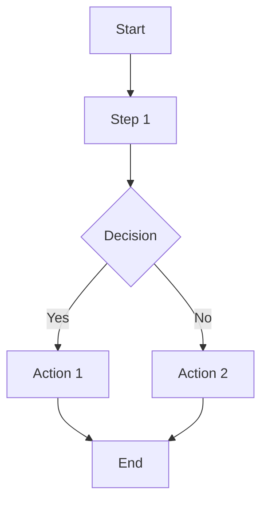

# [Workflow Name] Workflow

**Device Type:** [Implantable | Capital Equipment | Consumable | Surgical | etc.]
**Complexity:** [High | Medium | Low]
**Last Updated:** [Month Year]

---

## Overview

[Brief description of this workflow and when it applies]

### When This Workflow Applies

- [Condition 1]
- [Condition 2]
- [Condition 3]

### Key Stakeholders

| Role | Responsibility |
|------|----------------|
| [Role 1] | [What they do] |
| [Role 2] | [What they do] |
| [Role 3] | [What they do] |

---

## Workflow Phases

### Phase 1: [Phase Name]

**Trigger:** [What initiates this phase]
**Duration:** [Typical timeframe]
**Owner:** [Primary responsible party]

**Steps:**
1. [Step 1]
2. [Step 2]
3. [Step 3]

**Outputs:**
- [Output 1]
- [Output 2]

---

### Phase 2: [Phase Name]

**Trigger:** [What initiates this phase]
**Duration:** [Typical timeframe]
**Owner:** [Primary responsible party]

**Steps:**
1. [Step 1]
2. [Step 2]
3. [Step 3]

**Outputs:**
- [Output 1]
- [Output 2]

---

## Workflow Diagram

---

## Variations by Recall Class

| Class | Variation |
|-------|-----------|
| **Class I** | [How workflow differs] |
| **Class II** | [How workflow differs] |
| **Class III** | [How workflow differs] |

---

## Documentation Requirements

| Document | Required By | Template |
|----------|-------------|----------|
| [Document 1] | [Regulation/Standard] | [Link if available] |
| [Document 2] | [Regulation/Standard] | [Link if available] |

---

## RecallWire Features That Support This Workflow

- [Feature 1] — [How it helps]
- [Feature 2] — [How it helps]
- [Feature 3] — [How it helps]

---

## Related Workflows

- [Workflow](./path.md) - [Relationship]
