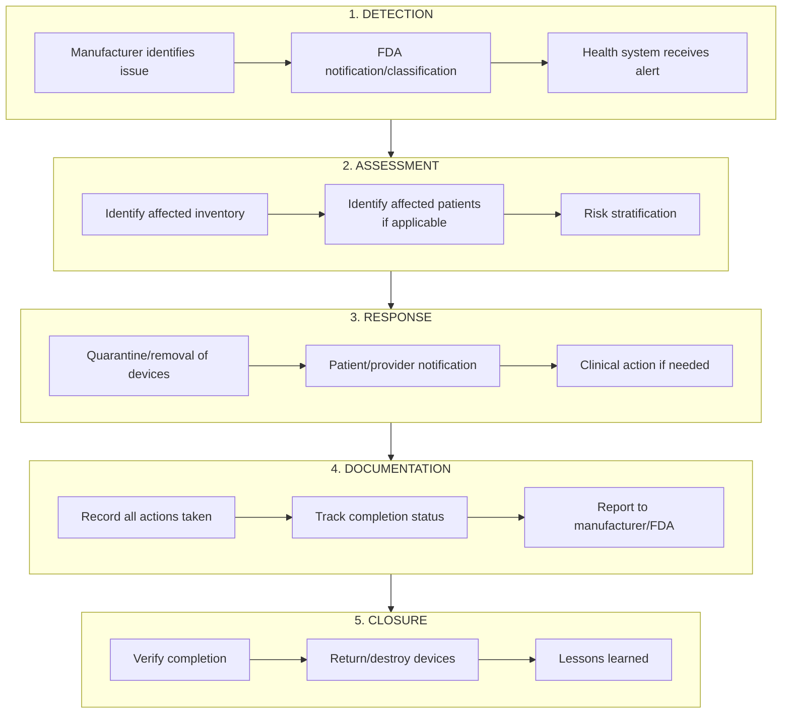

# Medical Device Recall Workflows Overview

## Executive Summary

Medical device recalls in the radiology/surgical/medical device realm do **not** follow a single unified workflow. Instead, the workflow varies based on three key dimensions:

1. **Recall Classification (I, II, III)** - Determines urgency, reporting requirements, and public notification
2. **Device Type** - Implantable vs. non-implantable devices have fundamentally different patient impact
3. **Device Category** - Imaging equipment, surgical instruments, and implants involve different hospital departments

## Recall Classification Framework

The FDA assigns recalls a classification based on health hazard severity:

| Class | Risk Level | Description | Reporting Required |
|-------|------------|-------------|-------------------|
| **Class I** | Highest | Reasonable probability of serious adverse health consequences or death | Yes - Immediate |
| **Class II** | Moderate | May cause temporary/reversible health problems; remote chance of serious consequences | Yes |
| **Class III** | Lowest | Not likely to cause adverse health consequences (labeling, documentation issues) | Record-keeping only |

## Key Workflow Variations

### By Device Type

| Device Type | Key Workflow Differences |
|-------------|-------------------------|
| **Implanted Devices** | Patient identification required; explant vs. monitor decision; surgeon communication; long-term tracking |
| **Capital Equipment** | Facility-based; service/repair coordination; downtime management; no patient identification needed |
| **Consumables/Disposables** | Inventory sweep; lot/batch tracking; supply chain coordination |
| **Software/SaMD** | Version tracking; remote update capability; system-wide deployment |

### By Hospital Department

| Department | Typical Devices | Unique Considerations |
|------------|-----------------|----------------------|
| **Radiology** | CT, MRI, X-ray, ultrasound | High capital cost; imaging continuity; PACS integration |
| **Surgery/OR** | Implants, instruments, robotics | Patient tracking; explant decisions; surgeon notification |
| **Cath Lab** | Stents, catheters, pacemakers | Implant registry; cardiology follow-up |
| **Laboratory** | Analyzers, reagents, diagnostics | Result validity; re-testing protocols |

## Universal Workflow Phases

Despite variations, all medical device recalls follow these general phases:

## Workflow Documents in This Folder

| Document | Description |
|----------|-------------|
| [01-fda-manufacturer-workflow.md](./01-fda-manufacturer-workflow.md) | The FDA/manufacturer side of recall initiation |
| [02-hospital-recall-workflow.md](./02-hospital-recall-workflow.md) | Hospital internal recall response process |
| [03-implantable-device-workflow.md](./03-implantable-device-workflow.md) | Specific workflow for implanted devices |
| [04-imaging-equipment-workflow.md](./04-imaging-equipment-workflow.md) | Workflow for radiology/imaging equipment |
| [05-surgical-instrument-workflow.md](./05-surgical-instrument-workflow.md) | Workflow for surgical instruments |

## Key Challenges in Current Recall Workflows

1. **Communication Delays** - Paper-based notifications can take weeks to reach hospitals
2. **Patient Identification** - Matching recalled devices to patients requires cross-referencing siloed data
3. **Fragmented Systems** - EHR, inventory, and recall databases rarely integrate
4. **Resource Constraints** - FDA recall coordinator positions remain understaffed
5. **Inconsistent Tracking** - UDI adoption is incomplete across the industry

## Sources

- [FDA Medical Device Recalls](https://www.fda.gov/medical-devices/medical-device-safety/medical-device-recalls)
- [FDA Recalls, Corrections and Removals](https://www.fda.gov/medical-devices/postmarket-requirements-devices/recalls-corrections-and-removals-devices)
- [GAO Report on Medical Device Recalls](https://www.gao.gov/products/gao-26-107619)
