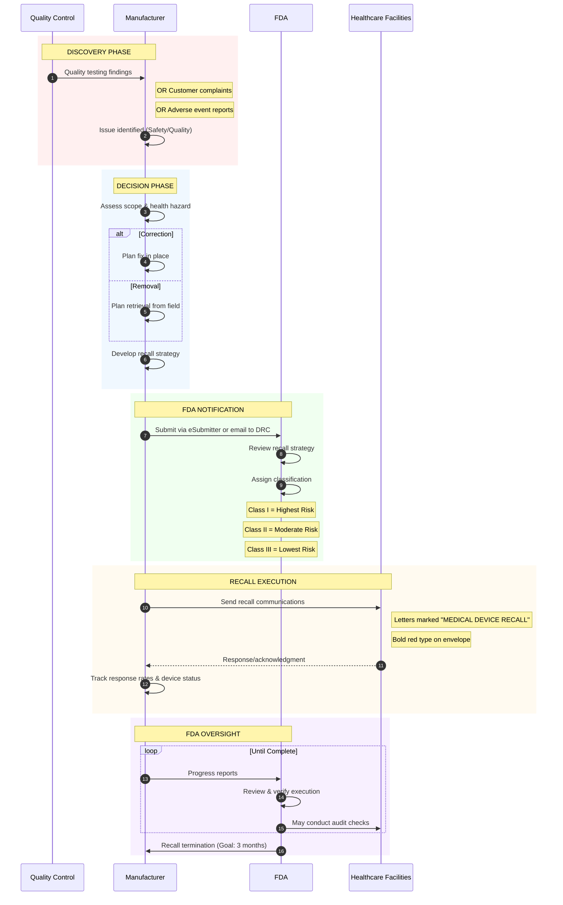
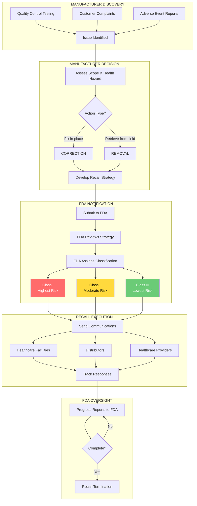

# FDA & Manufacturer Recall Initiation Workflow

## Overview

This document describes the workflow from the manufacturer's perspective when initiating a medical device recall, and the FDA's role in classification and oversight.

## Recall Initiation Types

| Type | Authority | Frequency |
|------|-----------|-----------|
| **Voluntary Recall** | 21 CFR Part 7 & 21 CFR Part 806 | ~99% of recalls |
| **Mandatory Recall** | 21 CFR 810 | Rare (FDA-ordered) |

## Workflow Diagram

### Flowchart View: Recall Decision Tree

## Recall Communication Requirements

### Required Content in Recall Notices

| Element | Description |
|---------|-------------|
| **Device Identification** | Name, model, lot/serial numbers, UDI if applicable |
| **Problem Description** | Clear explanation of the issue |
| **Health Hazard** | Potential risks to patients/users |
| **Instructions** | What the recipient should do |
| **Contact Information** | How to reach manufacturer |
| **Response Requested** | What the manufacturer needs back |

### Reporting Timeline

| Action | Timeframe |
|--------|-----------|
| Initial report to FDA | Within 10 working days of initiating recall |
| Periodic status reports | As requested by FDA |
| Final status report | When recall is complete |

## Key Differences by Recall Class

| Aspect | Class I | Class II | Class III |
|--------|---------|----------|-----------|
| **FDA Public Notice** | Press release likely | May be posted | Rarely publicized |
| **Reporting to FDA** | Required | Required | Record-keeping only |
| **Urgency** | Immediate | Standard | Low priority |
| **Audit Likelihood** | High | Moderate | Low |

## Tracking Requirements (21 CFR 821)

For certain high-risk and implantable devices, manufacturers must maintain tracking systems that allow:
- Identification of each device by lot or serial number
- Location of device (facility or patient)
- Date of distribution/implantation
- Patient identification (for implants)

Tracked devices include:
- Life-sustaining/life-supporting devices used outside facilities
- Permanently implantable devices
- Devices designated by FDA for tracking

## Sources

- [FDA Recalls, Corrections and Removals](https://www.fda.gov/medical-devices/postmarket-requirements-devices/recalls-corrections-and-removals-devices)
- [FDA Industry Guidance for Recalls](https://www.fda.gov/safety/recalls-market-withdrawals-safety-alerts/industry-guidance-recalls)
- [21 CFR Part 7 - Enforcement Policy](https://www.ecfr.gov/current/title-21/chapter-I/subchapter-A/part-7)
- [21 CFR Part 806 - Medical Devices; Reports of Corrections and Removals](https://www.ecfr.gov/current/title-21/chapter-I/subchapter-H/part-806)
