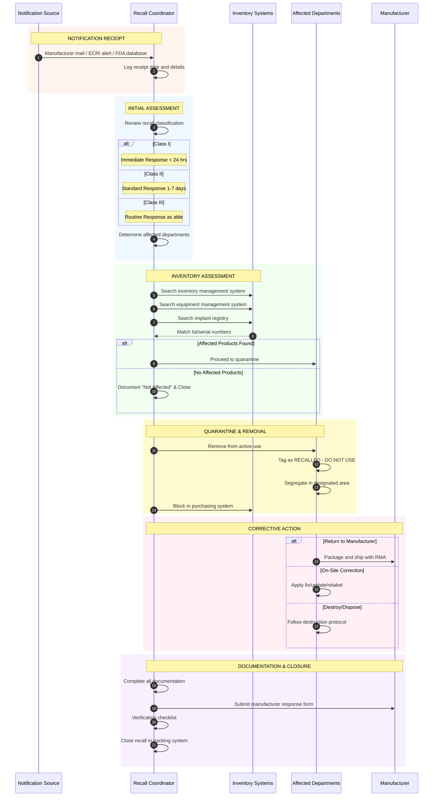
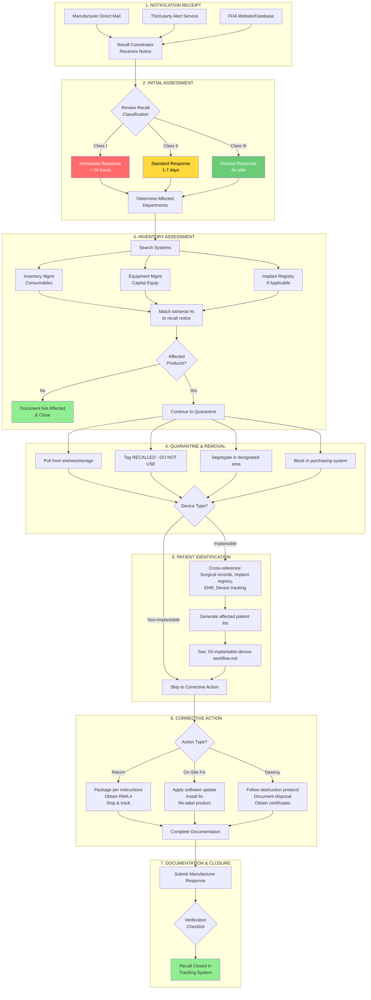

# Hospital Internal Recall Response Workflow

## Overview

This document describes the workflow a hospital or health system follows when responding to a medical device recall. This process is governed by Joint Commission standard EC.02.01.01 EP 11, which requires hospitals to have procedures for monitoring and acting on product hazard notices and recalls.

## Organizational Structure

### Recommended Recall Committee Composition

| Department | Role in Recall Process |
|------------|----------------------|
| **Clinical Engineering / Biomed** | Equipment identification, service coordination |
| **Materials Management / Supply Chain** | Inventory tracking, product procurement |
| **Risk Management** | Liability assessment, documentation oversight |
| **Quality / Patient Safety** | Patient impact assessment, outcome tracking |
| **Radiology** | Department-specific imaging equipment |
| **Surgery / OR** | Surgical instruments, implants |
| **Nursing** | Point-of-care devices, patient notification |
| **Pharmacy** | Drug-device combinations |
| **IT** | Software devices, system updates |
| **Administration** | Resource allocation, executive decisions |

### Key Roles

| Role | Responsibilities |
|------|-----------------|
| **Recall Coordinator** | Central point for receiving/acting on all recalls |
| **Department Liaisons** | Department-level implementation |
| **Patient Navigator** | Patient communication for implant recalls |

## Workflow Diagram

### Sequence Diagram: Hospital Recall Response

### Flowchart: Hospital Recall Decision Tree

## Response Timeline Guidelines

| Recall Class | Initial Response | Investigation | Completion |
|-------------|------------------|---------------|------------|
| **Class I** | Same day | 24-48 hours | ASAP |
| **Class II** | 1-2 days | 1 week | 2-4 weeks |
| **Class III** | 3-5 days | 2 weeks | As able |

## Common Challenges

| Challenge | Mitigation |
|-----------|-----------|
| **Multiple systems to search** | Implement unified recall management software |
| **Incomplete inventory data** | Enforce UDI scanning at receipt/use |
| **Decentralized receipt of notices** | Centralize to single recall coordinator |
| **Late manufacturer notifications** | Subscribe to third-party alert services |
| **Staff awareness** | Regular recall training, visible alerts |

## Compliance Requirements

### Joint Commission (EC.02.01.01 EP 11)
- Written procedure for monitoring hazard notices/recalls
- Designated responsible person
- Coordination across departments
- Documentation of actions taken

### CMS Conditions of Participation
- Maintain safe environment
- Report adverse events
- Respond to known hazards

## Sources

- [24x7 Magazine: Effectively Managing Recalls](https://24x7mag.com/standards/regulations/effectively-managing-recalls/)
- [ECRI Automated Recall Management](https://home.ecri.org/pages/ecri-alerts-workflow-automated-recall-management-software)
- [Remington Medical: What to Do After a Recall](https://remmed.com/what-to-do-if-a-medical-device-is-recalled/)
