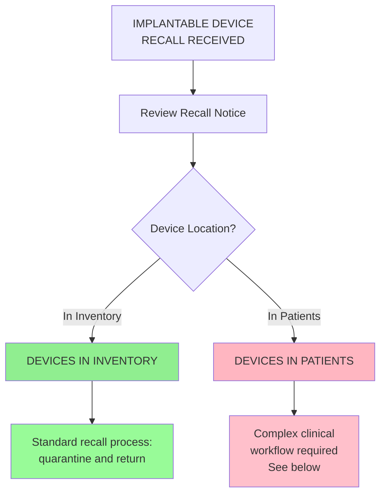
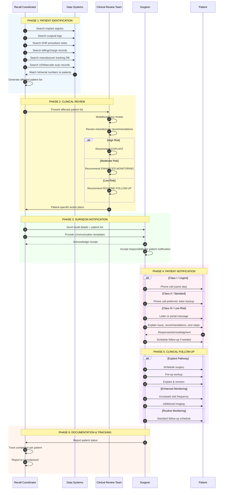
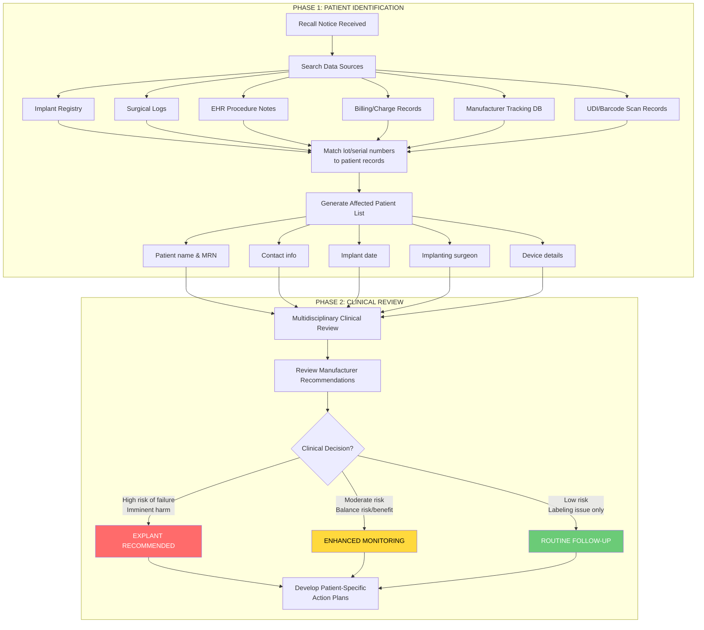
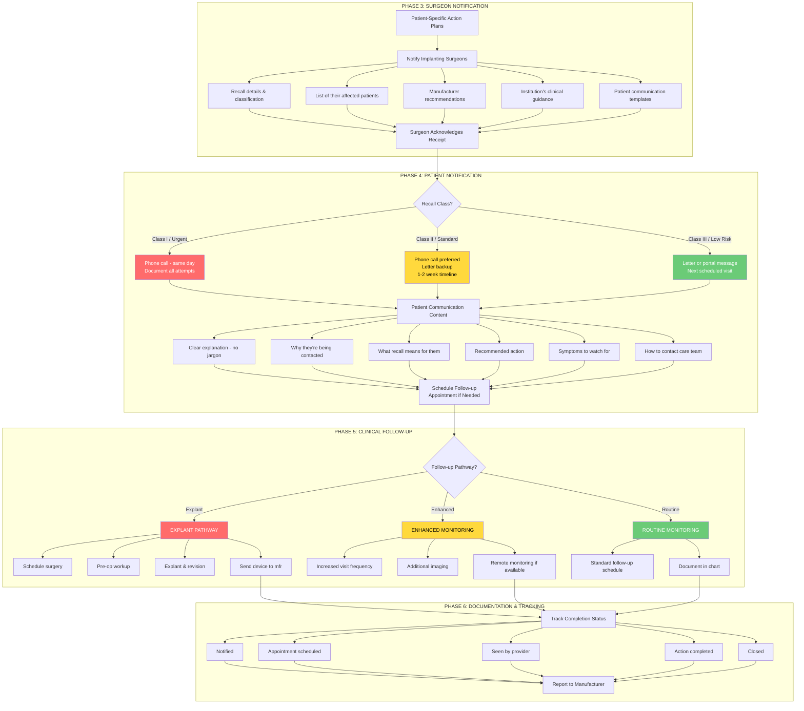
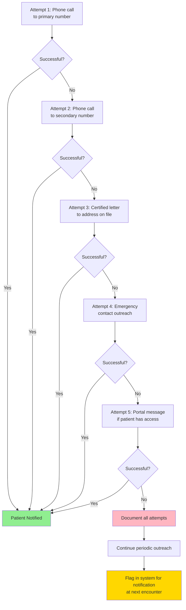

# Implantable Device Recall Workflow

## Overview

Implantable device recalls represent the most complex recall scenario because they require:
1. Patient identification and tracking
2. Clinical decision-making (explant vs. monitor)
3. Surgeon and patient communication
4. Long-term follow-up

This workflow applies to: joint replacements, pacemakers/ICDs, stents, surgical mesh, breast implants, spinal hardware, cochlear implants, and similar devices.

## Critical Distinction: Device in Patient vs. Device in Inventory

## Complete Implantable Device Recall Workflow

### Sequence Diagram: End-to-End Process

### Flowchart: Patient Identification & Clinical Decision

### Flowchart: Patient Notification & Follow-up

## Explant vs. Monitor Decision Framework

| Factor | Favors Explant | Favors Monitor |
|--------|---------------|----------------|
| **Device failure risk** | High/imminent | Low/theoretical |
| **Failure consequences** | Severe/life-threatening | Manageable |
| **Surgical risk** | Low | High (age, comorbidities) |
| **Device criticality** | Replaceable function | Life-sustaining |
| **Alternative available** | Yes | No/limited options |
| **Patient preference** | Prefers removal | Prefers to keep |
| **Time in body** | Recent | Long-standing, stable |

## Patient Unreachable Protocol

## Special Considerations by Device Type

### Cardiac Implants (Pacemakers, ICDs)
- Remote monitoring capability may allow early detection
- Device interrogation can provide data on function
- Manufacturer may provide firmware update option
- Consider temporary external monitoring during decision

### Orthopedic Implants (Hips, Knees, Spine)
- Imaging may be needed to assess device position/wear
- Pain/symptoms may indicate early failure
- Revision surgery is major undertaking
- Metal ion testing may be relevant

### Vascular Devices (Stents, Filters)
- May be high-risk to remove
- Monitoring for complications (thrombosis, migration)
- Anticoagulation considerations

## Challenges Specific to Implant Recalls

| Challenge | Impact | Mitigation |
|-----------|--------|-----------|
| **Incomplete tracking data** | Can't identify all patients | Improve UDI capture at implant |
| **Outdated contact info** | Can't reach patients | Verify at each visit |
| **Patient moved/transferred care** | Physician no longer managing | Coordination with new providers |
| **Deceased patients** | Still appear on lists | Death registry cross-reference |
| **Patient anxiety** | Psychological distress | Provide support resources |
| **Medicolegal concerns** | Liability exposure | Risk management involvement |

## Sources

- [ASPS: FDA Recalls - What Happens and What Should You Do](https://www.plasticsurgery.org/news/articles/fda-recalls-what-happens-when-there-is-a-recall-and-what-should-you-do)
- [AAOS Information Statement: Implant Device Recalls](https://www.aaos.org/globalassets/about/bylaws-library/information-statements/1019-implant-device-recalls1.pdf)
- [InVita: Match Medical Device Recall Notifications to Affected Patients](https://www.invitahealth.com/match-medical-device-recall-notifications-to-affected-patients/)
- [MedTech Dive: Anatomy of a Medical Device Recall](https://www.medtechdive.com/news/medical-device-recall-process-fda-philips-medtronic/608205/)
