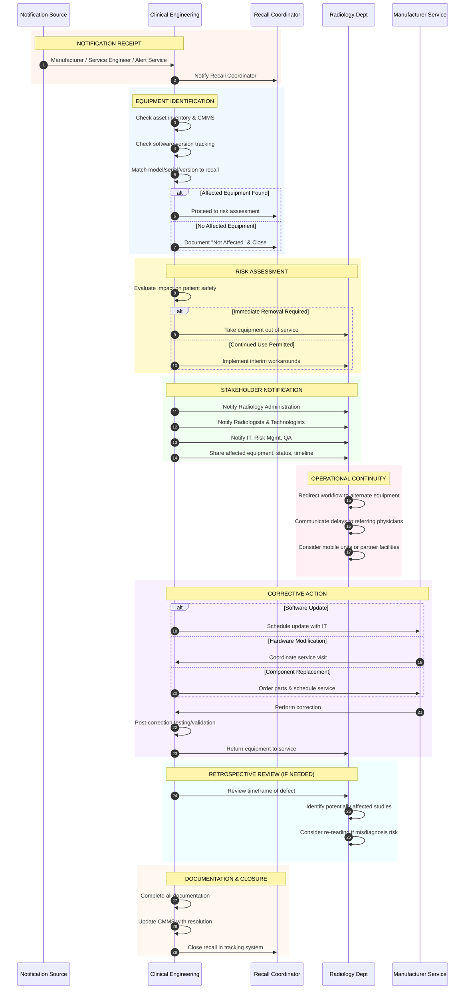
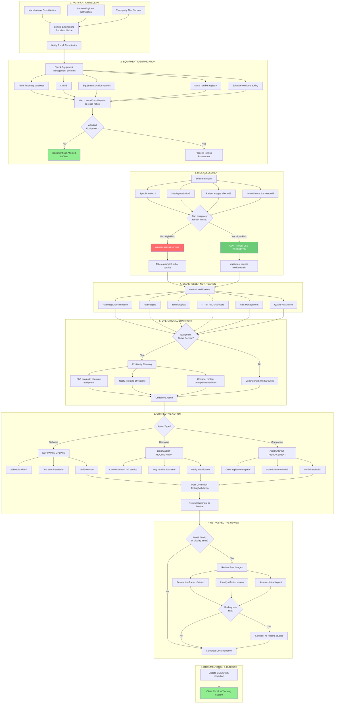

# Imaging & Radiology Equipment Recall Workflow

## Overview

Imaging equipment recalls differ significantly from implantable device recalls because:
1. **No patient identification required** - equipment is facility-based, not patient-based
2. **Operational continuity is critical** - must maintain imaging services
3. **High capital cost** - equipment replacement is expensive
4. **Software-heavy** - many recalls are software/firmware related

This workflow applies to: CT scanners, MRI systems, X-ray equipment, ultrasound systems, nuclear medicine cameras, PACS systems, and diagnostic imaging software.

## Common Recall Causes in Imaging Equipment

| Category | Percentage | Examples |
|----------|------------|----------|
| **Software** | ~49% | Display errors, calculation bugs, DICOM issues |
| **Design/Change Control** | ~17% | Hardware design flaws, component failures |
| **Other/Under Investigation** | ~16% | Various root causes |
| **Manufacturing** | ~10% | Assembly errors, quality escapes |
| **Labeling** | ~8% | Incorrect instructions, missing warnings |

## Workflow Diagram

### Sequence Diagram: Imaging Equipment Recall Response

### Flowchart: Imaging Equipment Recall Decision Tree

## Software-Specific Considerations

Many imaging equipment recalls are software-related. Special considerations:

| Consideration | Details |
|---------------|---------|
| **Version Tracking** | Maintain accurate software version records for all equipment |
| **Remote Updates** | Some manufacturers can push updates remotely |
| **PACS Integration** | Verify updates don't break DICOM or HL7 connectivity |
| **Validation Testing** | Test after update using standard protocols |
| **Rollback Plan** | Have plan if update causes problems |

## Integration with Radiology Workflow

| Workflow Element | Recall Impact |
|-----------------|---------------|
| **Scheduling** | May need to shift appointments |
| **Acquisition** | Technologists need awareness of affected units |
| **Interpretation** | Radiologists need to know if images may be affected |
| **PACS** | Software recalls may affect display/storage |
| **Reporting** | Critical findings may need re-review |

## Comparison: Imaging Equipment vs. Implantable Devices

| Aspect | Imaging Equipment | Implantable Devices |
|--------|-------------------|---------------------|
| **Patient ID needed** | No | Yes |
| **Primary stakeholder** | Radiology department | Surgeon + Patient |
| **Correction method** | Service/update | Explant or monitor |
| **Operational impact** | Downtime, scheduling | Clinical follow-up |
| **Urgency driver** | Service continuity | Patient safety |
| **Documentation** | Equipment-focused | Patient-focused |

## Sources

- [PMC: Medical Device Recalls in Radiation Oncology 2002-2015](https://pmc.ncbi.nlm.nih.gov/articles/PMC5518627/)
- [24x7 Magazine: Effectively Managing Recalls](https://24x7mag.com/standards/regulations/effectively-managing-recalls/)
- [ECRI Automated Recall Management](https://home.ecri.org/pages/ecri-alerts-workflow-automated-recall-management-software)
