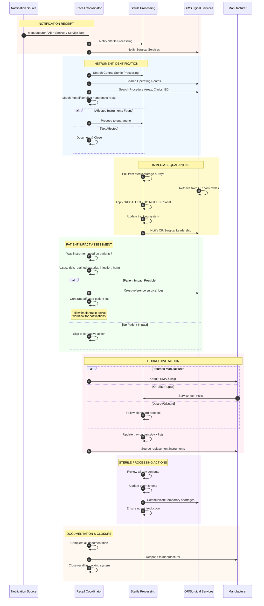
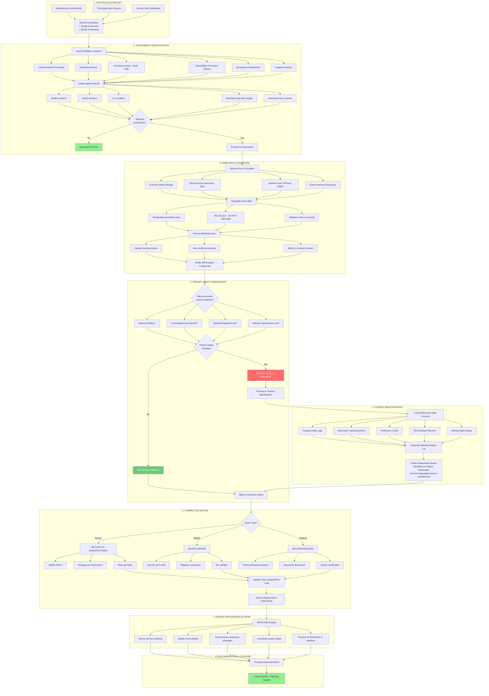
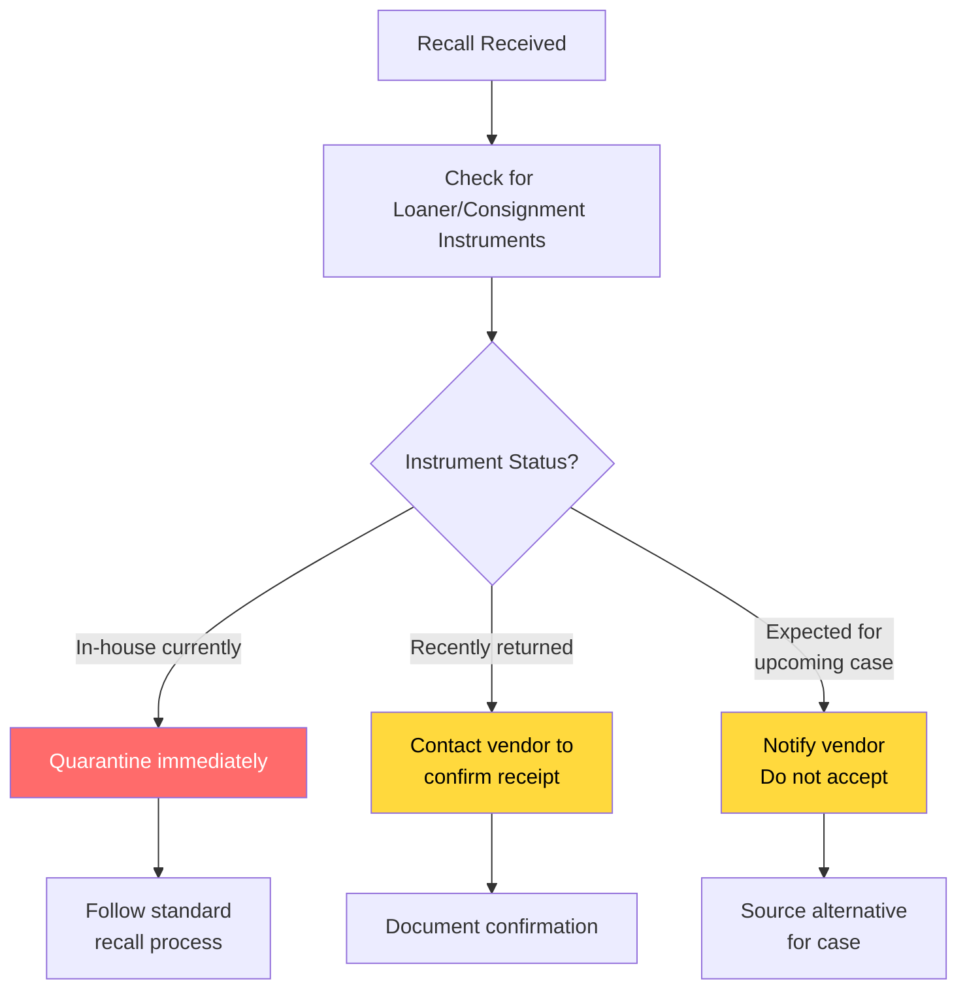

# Surgical Instrument Recall Workflow

## Overview

Surgical instrument recalls occupy a middle ground between implantable devices and capital equipment:
- They may require patient identification if used during procedures
- They are reusable, requiring inventory tracking across departments
- Sterile processing/central sterile plays a critical role
- Turnaround is often faster than imaging equipment recalls

This workflow applies to: surgical instruments, robotic surgical systems, reusable scopes, surgical power tools, electrosurgical devices, and similar equipment.

## Surgical Instrument Categories

| Category | Examples | Tracking Complexity |
|----------|----------|-------------------|
| **Reusable Instruments** | Forceps, retractors, scissors | Low (inventory) |
| **Power Equipment** | Drills, saws, powered instruments | Medium (serial tracked) |
| **Robotic Systems** | da Vinci, Mako, etc. | High (case logs) |
| **Scopes/Cameras** | Laparoscopes, arthroscopes | Medium (serial + reprocessing) |
| **Electrosurgical** | Generators, handpieces | Medium (serial tracked) |
| **Single-Use Instruments** | Disposable trocars, staplers | Low (lot tracking) |

## Workflow Diagram

### Sequence Diagram: Surgical Instrument Recall Response

### Flowchart: Surgical Instrument Recall Decision Tree

## Robotic Surgery System Considerations

Robotic surgical systems (e.g., da Vinci, Mako) have unique recall considerations:

| Aspect | Consideration |
|--------|--------------|
| **Case Tracking** | All procedures logged; easier patient identification |
| **Software Updates** | May be pushed remotely |
| **Instrument Arms** | Tracked individually, may require calibration |
| **Training Records** | May need to notify trained surgeons |
| **Service Contracts** | Manufacturer often manages updates |

## Loaner/Consignment Instrument Workflow

## Response Timeline by Recall Class

| Class | Quarantine | Investigation | Corrective Action |
|-------|------------|---------------|-------------------|
| **Class I** | Immediate | 24-48 hours | ASAP |
| **Class II** | Same day | 1 week | 2-4 weeks |
| **Class III** | 1-3 days | As needed | Standard timing |

## Common Surgical Instrument Recall Causes

| Cause | Examples | Patient Impact Likelihood |
|-------|----------|--------------------------|
| **Breakage/Fatigue** | Tip breaks off, retained in patient | High |
| **Sterility Breach** | Packaging failure | Moderate |
| **Manufacturing Defect** | Wrong material, sharp edges | Variable |
| **Labeling Error** | Wrong size indicated | Variable |
| **Software Bug** | Robotic system calculation error | High |
| **Cleaning Issues** | Scope reprocessing concerns | High |

## Sources

- [FDA Recalls, Corrections and Removals](https://www.fda.gov/medical-devices/postmarket-requirements-devices/recalls-corrections-and-removals-devices)
- [24x7 Magazine: Effectively Managing Recalls](https://24x7mag.com/standards/regulations/effectively-managing-recalls/)
- [ECRI Alerts Workflow](https://home.ecri.org/pages/ecri-alerts-workflow-automated-recall-management-software)
